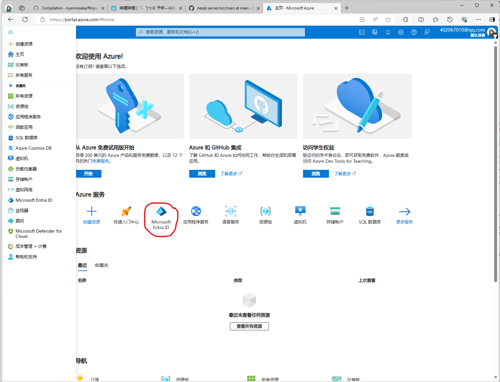
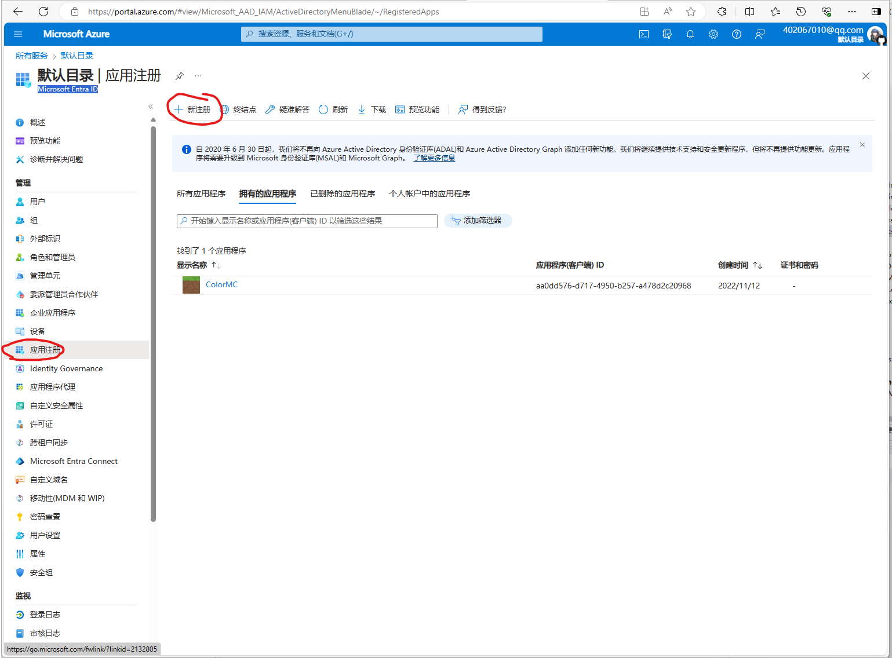

## 登录与启动

游戏启动前，需要玩家登录账户，而账户又分为很多种  
总体分为新版OAuth登录与旧方式登录

目前登录微软账户需要使用[新版OAuth流程](https://wiki.vg/Zh:Microsoft_Authentication_Scheme)
```
OAuth 微软登录 -> XBox Xbox验证 -> XSTS 好像是Xbox附属验证 -> Token 客户端密匙 -> Profile 账户信息
```
走完这套流程后就能拿到游戏UUID与token来启动游戏了

OAuth需要去申请一个`client_key`才能使用  
注册一个Azure 账户
点击`Microsoft Entra ID`  
  
注册一个应用  
  
然后按照下面设置  
  
  
复制`客户端ID`，后面要用到  

然后开始登录，准备一个HttpClient，开始请求，下面的`{类型}`都需要替换为对应的东西

### OAuth登录新账户

- OAuth  
```
POST https://login.microsoftonline.com/consumers/oauth2/v2.0/devicecode
Content-Type: application/x-www-form-urlencoded

client_id={client_key}&scope=XboxLive.signin offline_access
```
结果返回
```json
{
    "user_code": "5MTFVRR7",
    "device_code": "BAQABIQEAAADnfolhJpSnRYBxxxxA",
    "verification_uri": "https://www.microsoft.com/link",
    "expires_in": 900,
    "interval": 5,
    "message": "To sign in, use a web browser to open the page https://www.microsoft.com/link and enter the code 5MTFVRR7 to authenticate."
}
```
其中`user_code`需要展示出去，`device_code`需要储存，然后用户点击`verification_uri`链接，填写`user_code`进行登录  
然后在此期间，需要定时`interval`秒请求
```
POST https://login.microsoftonline.com/consumers/oauth2/v2.0/token
Content-Type: application/x-www-form-urlencoded

client_id={client_key}&grant_type=urn:ietf:params:oauth:grant-type:device_code&code={device_code}
```
结果返回分几种  
表示用户还没有登录成功，你需要继续等待后再次请求  
```json
{
    "error": "authorization_pending",
    "error_description": "AADSTS70016: Pending end-user authorization.\r\nTrace ID: aff0fcc8-257a-400c-a275-bba4a6a72600\r\nCorrelation ID: f820aa6d-9dd7-4fab-8e68-5521013aea2e\r\nTimestamp: 2019-04-04 16:04:58Z",
    "error_codes": [
        70016
    ],
    "timestamp": "2019-04-04 16:04:58Z",
    "trace_id": "aff0fcc8-257a-400c-a275-bba4a6a72600",
    "correlation_id": "f820aa6d-9dd7-4fab-8e68-5521013aea2e"
}
```
表示用户已经登录成功了
```json
{
    "token_type": "Bearer",
    "scope": "XboxLive.signin offline_access",
    "expires_in": 3600,
    "ext_expires_in": 3600,
    "access_token": "{token1}",
    "refresh_token": "{token2}",
    "id_token": "{token3}"
}
```
`access_token`用与后续请求，`refresh_token`用于刷新用户密钥，也就是免再次登录
- Xbox登录
```
POST https://user.auth.xboxlive.com/user/authenticate
Content-Type: application/json

{
    "Properties": {
        "AuthMethod": "RPS",
        "SiteName": "user.auth.xboxlive.com",
        "RpsTicket": "d={token1}"
    },
    "RelyingParty": "http://auth.xboxlive.com",
    "TokenType": "JWT"
}
```
结果返回
```json
{
   "IssueInstant":"2020-12-07T19:52:08.4463796Z",
   "NotAfter":"2020-12-21T19:52:08.4463796Z",
   "Token": "{xboxtoken}",
   "DisplayClaims":{
        "xui":[
            {
                "uhs": "{xboxuhs}"
            }
        ]
   }
}
```
其中`Token`需要保存
- XSTS
```
POST https://xsts.auth.xboxlive.com/xsts/authorize
Content-Type: application/json

{
    "Properties": {
        "SandboxId": "RETAIL",
        "UserTokens": [
            "{xboxtoken}"
        ]
    },
    "RelyingParty": "rp://api.minecraftservices.com/",
    "TokenType": "JWT"
}
```
结果返回
```json
{
   "IssueInstant":"2020-12-07T19:52:09.2345095Z",
   "NotAfter":"2020-12-08T11:52:09.2345095Z",
   "Token": "{xststoken}",
   "DisplayClaims":{
        "xui":[
            {
                "uhs": "{xstsuhs}"
            }
        ]
    }
}
```
其中`Token`与`DisplayClaims.xui.uhs`需要保存
- 游戏Token
```
POST https://api.minecraftservices.com/authentication/login_with_xbox
Content-Type: application/json

{
    "identityToken": "XBL3.0 x={xstsuhs};{xststoken}"
}
```
结果返回
```
{
    "username" : {username},
    "roles" : [ ],
    "access_token" : "{gametoken}",
    "token_type" : "Bearer",
    "expires_in" : 86400
}
```
其中`access_token`需要保存
- 游戏Profile
```
GET https://api.minecraftservices.com/minecraft/profile
Authorization: Bearer {gametoken}
```
结果返回
```
{
  "id" : "cced95f30a844377b8c18e60cf1b3fea",
  "name" : "Color_yr",
  "skins" : [ {
    "id" : "89fe094b-6511-4117-b9d4-46cf5ba9d99c",
    "state" : "ACTIVE",
    "url" : "http://textures.minecraft.net/texture/be9b4b65c81c47cda6effe173a90abc32864e4b147d37a7a3854287393c48bec",
    "textureKey" : "be9b4b65c81c47cda6effe173a90abc32864e4b147d37a7a3854287393c48bec",
    "variant" : "SLIM"
  } ],
  "capes" : [ {
    "id" : "5af20372-79e0-4e1f-80f8-6bd8e3135995",
    "state" : "ACTIVE",
    "url" : "http://textures.minecraft.net/texture/2340c0e03dd24a11b15a8b33c2a7e9e32abb2051b2481d0ba7defd635ca7a933",
    "alias" : "Migrator"
  } ],
  "profileActions" : { }
}
```
这里就是用户信息了，需要取出`id`在启动时充当`auth_uuid`  
注意`Bearer`后面是带一个空格的，不要漏了
最后对应的启动参数替换值
```
auth_access_token -> gametoken
auth_uuid -> id
auth_player_name -> username
```

### OAuth刷新密钥
该步骤需要OAtuh步骤中的，`refresh_token`，然后请求
```
POST https://login.microsoftonline.com/consumers/oauth2/v2.0/token
Content-Type: application/x-www-form-urlencoded

client_id={client_key}&grant_type=refresh_token&refresh_token={token2}
```
返回结果和初次OAuth登录一样，同样需要重新存储`refresh_token`，也就是登录一次`refresh_token`要刷新一次  
后面的步骤就是一模一样的了

### 第三方登录
例如[统一通行证Nide8](https://login.mc-user.com:233/)和[littleskin皮肤站](https://littleskin.cn/)这种外置登录  
都是用了旧版登录方式

旧版登录方式很简单，只需要请求
```
POST https://验证地址/authserver/authenticate
Content-Type: application/json

{
    // 可选
    "agent": {	
        // 启动器名称
        "name": "ColorMC",	
        // 启动器版本
        "version": "1.25"
    },
    "username": "用户名",
    "password": "密码",
    // 客户端UUID
    "clientToken": "XXXXXXXX-XXXX-XXXX-XXXXXXXXXXXXXXXX"
}
```
**注意，该部分为明文传输，请一定要使用https而不是http**
结果返回
```json
{
    // 访问令牌
    "accessToken": "XXXXXXXXXXXXXXXXXXXXXXXXXXXXXXXX",	
    // 客户端UUID
    "clientToken": "XXXXXXXX-XXXX-XXXX-XXXXXXXXXXXXXXXX",	
    "selectedProfile": {
        "id": "XXXXXXXXXXXXXXXXXXXXXXXXXXXXXXXX",	//玩家UUID
        "name": "游戏ID"
    }
}
```
`accessToken`是需要保存的东西，建议`clientToken`不为空的发送到服务器，方便后续操作  

刷新token使用
```
POST  https://验证地址/authserver/refresh
Content-Type: application/json

{
    "accessToken": "{accessToken}"
    "clientToken": "{clientToken}"
}
```
结果返回和登录一样的东西

### 游戏启动

游戏启动需要JAVA，JAVA的下载与安装不在该教程范围内
启动前需要检查所有游戏文件，运行库，资源文件，游戏核心等，然后开始拼接启动参数  
启动参数主要由几部分组成
```
javaw.exe(其他操作系统为java) JVM参数 主类 游戏参数
```
这里以1.20.4为例子  
JVM参数 主类 游戏参数 都能在游戏元数据中获取，然后再加入最大内存与最小内存等，然后得到下面的结果
```
javaw.exe
-XX:HeapDumpPath=MojangTricksIntelDriversForPerformance_javaw.exe_minecraft.exe.heapdump
-Xss1M
-Xmx4G 
-Xms512M
-Djna.tmpdir=${natives_directory}
-Dorg.lwjgl.system.SharedLibraryExtractPath=${natives_directory}
-Dio.netty.native.workdir=${natives_directory}
-Dminecraft.launcher.brand=${launcher_name}
-Dminecraft.launcher.version=${launcher_version}
-cp
${classpath}
net.minecraft.client.main.Main
--username"
${auth_player_name}
--version
${version_name}
--gameDir
${game_directory}
--assetsDir
${assets_root}
--assetIndex
${assets_index_name}
--uuid
${auth_uuid}
--accessToken
${auth_access_token}
--clientId
${clientid}
--xuid
${auth_xuid}
--userType
${user_type}
--versionType
${version_type}
```

然后还要把参数中的各项`${}`东西换掉  
`${natives_directory}`->`Native`所在的目录  
`${launcher_name}`->启动器名字  
`${launcher_version}`->启动器版本
`${classpath}`->ClassPath
`${auth_player_name}`->用户名
`${version_name}`->版本号
`${game_directory}`->游戏目录，就是config啥的目录
`${assets_root}`->资源目录
`${assets_index_name}`->资源元数据名，不用带json 例如1.12.2，12
`${auth_uuid}`->用户UUID
`${auth_access_token}`->登录密钥
`${clientid}`->客户端ID（可以不换）
`${auth_xuid}`->不知道这是啥（可以不换）
`${user_type}`->账户类型，如果是正版登录就为msa，其他为mojang
`${version_type}`->游戏类型，就是发布版类型，填release好像也行
- ClassPath  
这是JVM所需的运行库引导，需要填绝对路径  
在游戏元数据中，已经获取到了所有的运行库，那么需要一个个的获取绝对路径填进来  
例如
```
E:\code\ColorMC\src\ColorMC.Launcher\bin\Release\net8.0\minecraft\libraries\com\cleanroommc\cleanroom\15.24.0.3028\cleanroom-15.24.0.3028.jar;E:\code\ColorMC\src\ColorMC.Launcher\bin\Release\net8.0\minecraft\libraries\org\lwjgl3\lwjgl3-glfw\3.3.4-27-CLEANROOM\lwjgl3-glfw-3.3.4-27-CLEANROOM.jar;E:\code\ColorMC\src\ColorMC.Launcher\bin\Release\net8.0\minecraft\libraries\org\lwjgl3\lwjgl3-jemalloc\3.3.4-27-CLEANROOM\lwjgl3-jemalloc-3.3.4-27-CLEANROOM.jar;E:\code\ColorMC\src\ColorMC.Launcher\bin\Release\net8.0\minecraft\libraries\org\lwjgl3\lwjgl3-openal\3.3.4-27-CLEANROOM\lwjgl3-openal-3.3.4-27-CLEANROOM.jar;
...
```
jar之间用`;`隔开，如果是Linux或者Unix操作系统，则需要使用`:`隔开  
将所有参数替换掉，按照那个启动参数启动新进程，就可以开启游戏了  

~~当然你也可以用JNI的方式启动，参数是一样的~~