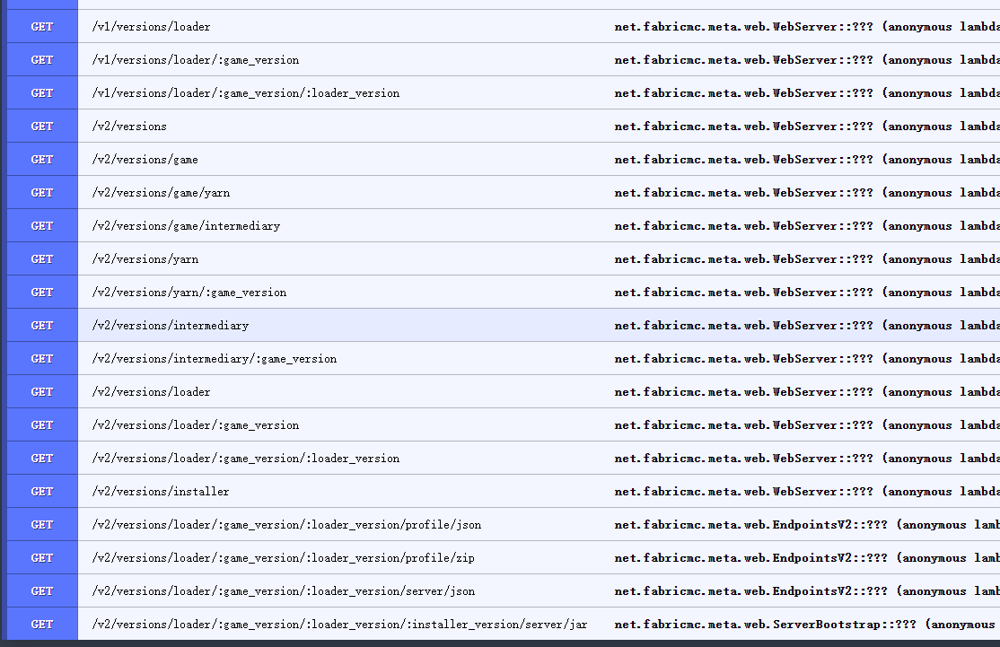
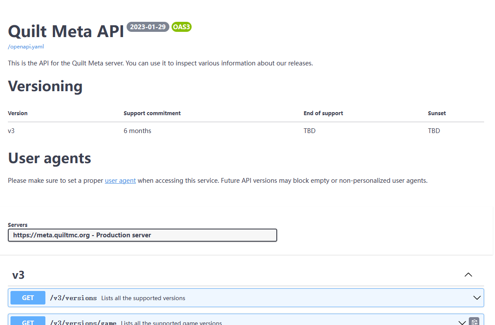

## 模组加载器

模组加载器分为两大类：运行前安装 运行时安装

有些模组加载器可以在运行时安装然后启动，启动方式大致分为
- 直接启动
- 安装后启动

Forge旧版\Fabric\Quilt加载器为直接启动  
Forge新版\NeoForge加载器为安装后启动  

本教程的加载器只会讲解Forge与Fabric，其他加载器不会讲解  
类似NeoForge与Forge，Quilt类似与Fabric，其工作方式解析方式基本上是一样的，可以直接套用  

Forge的元数据有两个版本V1和V2，启动方式也有新旧两种  
Fabric的元数据只有一个版本，启动方式也只有一种

### Forge元数据获取

Forge的获取主要从Forge的maven获取  
首先是获取版本元数据  
```
GET https://maven.minecraftforge.net/net/minecraftforge/forge/maven-metadata.xml
```
得到下面的数据
```xml
<metadata>
    <groupId>net.minecraftforge</groupId>
    <artifactId>forge</artifactId>
    <versioning>
        <release>1.20-46.0.14</release>
        <latest>1.20-46.0.14</latest>
        <lastUpdated>20240227203121</lastUpdated>
        <versions>
            <version>1.20-46.0.14</version>
            <version>1.20-46.0.13</version>
            <version>1.20-46.0.12</version>
            <version>1.20-46.0.11</version>
            <version>1.20-46.0.10</version>
            <version>1.20-46.0.2</version>
            <version>1.20-46.0.1</version>
            <version>1.20.4-49.0.31</version>
            <version>1.20.4-49.0.30</version>
            ...
        </versions>
    </versioning>
</metadata>
```
有了这个Forge元数据，就可以知道所有Forge的版本了，包括支持的游戏版本，游戏对应的Forge版本

然后是下载Forge安装器，你需要下载Forge安装器才知道后续步骤，这里选择一个版本下载  
```
GET https://maven.minecraftforge.net/net/minecraftforge/forge/1.20.4-49.0.31/forge-1.20.4-49.0.31-installer.jar
```
将这个jar内容进行查看，jar里面可以获得所有Forge的基础信息  
Forge基础信息分为V1和V2两个版本  
根据jar里面的内容来判断文件来判断版本  
若有`install_profile.json`与`version.json`两个文件，则为V2版本  
只有`install_profile.json`则为V1版本

**有些版本号拼接不一定是这样，例如1.7.10的下载地址为**
```
GET https://maven.minecraftforge.net/net/minecraftforge/forge/1.7.10-10.13.4.1614-1.7.10/forge-1.7.10-10.13.4.1614-1.7.10-installer.jar
```

### ForgeV1解析运行库
解压installer jar，需要拿到两个文件
```
- forge-1.11.2-13.20.1.2588-installer.jar \
  - install_profile.json
  - forge-1.11.2-13.20.1.2588-universal.jar
```

这个json文件是Forge安装时需要的信息  
这个jar文件是Forge运行时需要的东西

然后解压universal jar，取出一个文件
```
- forge-1.11.2-13.20.1.2588-universal.jar \
  - version.json
```

`version.json`与`install_profile.json`都有运行时需要的信息  
这两个json中，都有`libraries`这个列表，你需要下载这个列表中的运行库  
需要下载并放在一个文件夹中，`libraries`列表里面的节点有好几种格式  

- 例1
```json
{
    "name": "net.minecraft:launchwrapper:1.12",
    "serverreq": true
}
```
通常放在
```
libraries/net/minecraft/launchwrapper/1.12/launchwrapper-1.12.jar
```
下载地址为
```
https://libraries.minecraft.net/net/minecraft/launchwrapper/1.12/launchwrapper-1.12.jar
```
- 例2
```json
{
    "name": "jline:jline:2.13",
    "url": "https://maven.minecraftforge.net/",
    "checksums": [
        "2d9530d0a25daffaffda7c35037b046b627bb171"
    ],
    "serverreq": true,
    "clientreq": false
}
```
这个不要求客户端装，跳过
- 例3
```json
{
    "name": "com.typesafe:config:1.2.1",
    "url": "https://maven.minecraftforge.net/",
    "checksums": [
        "f771f71fdae3df231bcd54d5ca2d57f0bf93f467",
        "7d7bc36df0989d72f2d5d057309675777acc528b"
    ],
    "serverreq": true,
    "clientreq": true
}
```
通常放在
```
libraries/com/typesafe/config/1.2.1/config-1.2.1.jar
```
下载地址为
```
https://maven.minecraftforge.net/com/typesafe/config/1.2.1/config-1.2.1.jar
```
以此类推，将两个`libraries`数组中的库下载，去掉重复的，这样就算下载完资源了

### ForgeV2解析运行库
解压installer jar，需要拿到两个文件
```
- forge-1.20.4-49.0.31-installer.jar \
  - install_profile.json
  - version.json
```

你发现，其实V2的`install_profile.json`与`version.json`和V1的格式几乎是一样的  
只有`libraries`部分的解析是不一样的，剩余的运行库下载的操作是一样的

### Forge旧版启动
这里以1.12.2版本为例  
启动前已经下载好了minecraft游戏文件，Forge运行库，Forge文件等

然后开始拼接启动参数  
读取`version.json`，你会发现，里面有个`minecraftArguments`  
这个就是游戏启动参数，这里也没有JVM启动参数  
然后就跟原版使用的JVM启动参数
```
-Djava.library.path=${natives_directory}
-cp
${classpath}
```
一样即可，然后进行参数拼接
```
javaw.exe
-Djava.library.path=${natives_directory}
-Xss1M
-Xmx4G 
-Xms512M
-cp
${classpath}
net.minecraft.launchwrapper.Launch
--username
${auth_player_name}
--version
${version_name}
--gameDir
${game_directory}
--assetsDir
${assets_root}
--assetIndex
${assets_index_name}
--uuid
${auth_uuid}
--accessToken
${auth_access_token}
--clientId
${clientid}
--userType
${user_type}
--versionType
${version_type}
--tweakClass
net.minecraftforge.fml.common.launcher.FMLTweaker
--versionType
Forge
```
上面是Forge的启动参数，主要区别就是在原版的启动参数上做修改  
将MainClass改成了launchwrapper的，然后在游戏参数中添加了一些内容  

之后在替换掉对应的变量，添加Forge的libs到classpath中，即可启动游戏  

### Forge新版启动
在1.13及以上版本，不再使用launchwrapper作为启动模板，因此Forge启动前需要安装，其过程大致为
```
反编译 反混淆 修改代码 重编译 重混淆
```

安装与启动步骤可以通过[ForgeWrapper](https://github.com/ZekerZhayard/ForgeWrapper)一步实现，只需要启动`ForgeWrapper`就会自动完成安装与启动

和旧版一样，也需要将所有的运行库补全  
然后下载`ForgeWrapper`，并将jar放好  
读取`version.json`开始拼接启动参数  
但是这回的拼接有些不一样，是需要在原版的参数上进行添加，并替换掉mainClass  
`version.json`中也有个叫`arguments`的信息，里面也有`game`与`jvm`  
对应的是给游戏参数与JVM参数添加内容，添加与修改完成后的启动参数为
```
javaw.exe
-XX:HeapDumpPath=MojangTricksIntelDriversForPerformance_javaw.exe_minecraft.exe.heapdump
-Xss1M
-Xmx4G 
-Xms512M
-Djna.tmpdir=${natives_directory}
-Dorg.lwjgl.system.SharedLibraryExtractPath=${natives_directory}
-Dio.netty.native.workdir=${natives_directory}
-Dminecraft.launcher.brand=${launcher_name}
-Dminecraft.launcher.version=${launcher_version}
-cp
${classpath}
-Djava.net.preferIPv6Addresses=system
net.minecraftforge.bootstrap.ForgeBootstrap
--username"
${auth_player_name}
--version
${version_name}
--gameDir
${game_directory}
--assetsDir
${assets_root}
--assetIndex
${assets_index_name}
--uuid
${auth_uuid}
--accessToken
${auth_access_token}
--clientId
${clientid}
--xuid
${auth_xuid}
--userType
${user_type}
--versionType
${version_type}
--launchTarget
forge_client
```

注意：若添加了`-Djava.net.preferIPv6Addresses=system`则会破坏原有的局域网模式

然后使用`ForgeWrapper`还要求需要往JVM参数添加东西，并替换掉主类  
```
-Dforgewrapper.librariesDir=${librariesPath}
-Dforgewrapper.installer=${forgeInstallerPath}
-Dforgewrapper.minecraft=${minecraftPath}
```
`librariesPath`为运行库文件夹  
`forgeInstallerPath`为Forge安装器位置  
`minecraftPath`为游戏核心位置

主类需要替换为`io.github.zekerzhayard.forgewrapper.installer.Main`

于是，启动参数改为了
```
javaw.exe
-XX:HeapDumpPath=MojangTricksIntelDriversForPerformance_javaw.exe_minecraft.exe.heapdump
-Xss1M
-Xmx4G 
-Xms512M
-Djna.tmpdir=${natives_directory}
-Dorg.lwjgl.system.SharedLibraryExtractPath=${natives_directory}
-Dio.netty.native.workdir=${natives_directory}
-Dminecraft.launcher.brand=${launcher_name}
-Dminecraft.launcher.version=${launcher_version}
-cp
${classpath}
-Djava.net.preferIPv6Addresses=system
-Dforgewrapper.librariesDir=${librariesPath}
-Dforgewrapper.installer=${forgeInstallerPath}
-Dforgewrapper.minecraft=${minecraftPath}
io.github.zekerzhayard.forgewrapper.installer.Main
--username"
${auth_player_name}
--version
${version_name}
--gameDir
${game_directory}
--assetsDir
${assets_root}
--assetIndex
${assets_index_name}
--uuid
${auth_uuid}
--accessToken
${auth_access_token}
--clientId
${clientid}
--xuid
${auth_xuid}
--userType
${user_type}
--versionType
${version_type}
--launchTarget
forge_client
```

使用该启动参数就能自动安装新版Forge并开启游戏了

~~1.20.2Forge以上需要启动2次才行，也是就是安装与启动~~

### Fabric获取与启动
首先Faric的元数据的接口在这个网址里面
```
GET https://meta.fabricmc.net/
``` 
  
通过这张图就可以知道有那些接口  
其中`/v2/versions`可以获取Fabric全部元数据
```
GET https://meta.fabricmc.net/v2/versions
```
得到下面数据
```json
{
    "game": [
        {
            "version": "24w10a",
            "stable": false
        },
        {
            "version": "24w09a",
            "stable": false
        },
        ...
    ],
    "mappings": [
        {
            "gameVersion": "24w10a",
            "separator": "+build.",
            "build": 3,
            "maven": "net.fabricmc:yarn:24w10a+build.3",
            "version": "24w10a+build.3",
            "stable": true
        },
        {
            "gameVersion": "24w10a",
            "separator": "+build.",
            "build": 2,
            "maven": "net.fabricmc:yarn:24w10a+build.2",
            "version": "24w10a+build.2",
            "stable": false
        },
        ...
    ],
    "intermediary": [
        {
            "maven": "net.fabricmc:intermediary:24w10a",
            "version": "24w10a",
            "stable": true
        },
        {
            "maven": "net.fabricmc:intermediary:24w09a",
            "version": "24w09a",
            "stable": true
        },
        ...
    ],
    "loader": [
        {
            "separator": ".",
            "build": 7,
            "maven": "net.fabricmc:fabric-loader:0.15.7",
            "version": "0.15.7",
            "stable": true
        },
        {
            "separator": ".",
            "build": 6,
            "maven": "net.fabricmc:fabric-loader:0.15.6",
            "version": "0.15.6",
            "stable": false
        },
        ...
    ],
    "installer": [
        {
            "url": "https://maven.fabricmc.net/net/fabricmc/fabric-installer/1.0.0/fabric-installer-1.0.0.jar",
            "maven": "net.fabricmc:fabric-installer:1.0.0",
            "version": "1.0.0",
            "stable": true
        },
        {
            "url": "https://maven.fabricmc.net/net/fabricmc/fabric-installer/0.11.2/fabric-installer-0.11.2.jar",
            "maven": "net.fabricmc:fabric-installer:0.11.2",
            "version": "0.11.2",
            "stable": false
        },
        ...
    ]
}
```
这里只需要关注`game`与`loader`，其他数据都不是重要的数据  
`game`为支持的游戏版本  
`loader`为加载器版本  
然后选定一个游戏版本，获取支持的加载器版本
```
GET https://meta.fabricmc.net/v2/versions/loader/1.20.4
```
得到数据
```json
[
    {
        "loader": {
            "separator": ".",
            "build": 7,
            "maven": "net.fabricmc:fabric-loader:0.15.7",
            "version": "0.15.7",
            "stable": true
        },
        "intermediary": {
            "maven": "net.fabricmc:intermediary:1.20.4",
            "version": "1.20.4",
            "stable": true
        },
        "launcherMeta": {
            "version": 2,
            "min_java_version": 8,
            "libraries": {
                "client": [],
                "common": [
                    {
                        "name": "org.ow2.asm:asm:9.6",
                        "url": "https://maven.fabricmc.net/",
                        "md5": "6f8bccf756f170d4185bb24c8c2d2020",
                        "sha1": "aa205cf0a06dbd8e04ece91c0b37c3f5d567546a",
                        "sha256": "3c6fac2424db3d4a853b669f4e3d1d9c3c552235e19a319673f887083c2303a1",
                        "sha512": "01a5ea6f5b43bf094c52a50e18325a60af7bb02e74d24f9bc2c727d43e514578fd968b30ff22f9d2720caec071458f9ff82d11a21fbb1ebc42d8203e737c4b52",
                        "size": 123598
                    },
                    ...
                ],
                "server": [],
                "development": [
                    {
                        "name": "io.github.llamalad7:mixinextras-fabric:0.3.5",
                        "url": "https://maven.fabricmc.net/",
                        "md5": "be5981bf56d3b747835482e0b5874c3f",
                        "sha1": "3b577be20ea942610b3045e4f0cd909fa415a9d3",
                        "sha256": "743bf47e4fa24642f843b9f85a5f1ba5125fb4b7e656e96b9c010a5043396047",
                        "sha512": "6ab94b7d310dd0af8b18c626cfa29fcd3008910db0d3937e07dc32af611d7fcea5e7ef938f76823c28e0ca230bb268662f6effb92beed3b68ca98d2dbfee80e2",
                        "size": 175184
                    }
                ]
            },
            "mainClass": {
                "client": "net.fabricmc.loader.impl.launch.knot.KnotClient",
                "server": "net.fabricmc.loader.impl.launch.knot.KnotServer"
            }
        }
    },
    ...
]
```
然后再选定一个加载器版本，获取加载器元数据
```
GET https://meta.fabricmc.net/v2/versions/loader/1.20.4/0.15.7/profile/json
```
得到数据
```json
{
    "id": "fabric-loader-0.15.7-1.20.4",
    "inheritsFrom": "1.20.4",
    "releaseTime": "2024-03-06T23:36:15+0000",
    "time": "2024-03-06T23:36:15+0000",
    "type": "release",
    "mainClass": "net.fabricmc.loader.impl.launch.knot.KnotClient",
    "arguments": {
        "game": [],
        "jvm": [
            "-DFabricMcEmu= net.minecraft.client.main.Main "
        ]
    },
    "libraries": [
        {
            "name": "org.ow2.asm:asm:9.6",
            "url": "https://maven.fabricmc.net/",
            "md5": "6f8bccf756f170d4185bb24c8c2d2020",
            "sha1": "aa205cf0a06dbd8e04ece91c0b37c3f5d567546a",
            "sha256": "3c6fac2424db3d4a853b669f4e3d1d9c3c552235e19a319673f887083c2303a1",
            "sha512": "01a5ea6f5b43bf094c52a50e18325a60af7bb02e74d24f9bc2c727d43e514578fd968b30ff22f9d2720caec071458f9ff82d11a21fbb1ebc42d8203e737c4b52",
            "size": 123598
        },
        ...
    ]
}
```
到这里，其结构跟Forge是相近的，处理方式可以说是一模一样的了  
运行使用的启动参数也是一模一样的添加方式，你需要添加进去  
同时Fabric启动也不需要运行前安装，直接填写参数启动即可  
同理`mainClass`也要进行修改  
最后Fabric的启动参数大致为
```
javaw.exe
-XX:HeapDumpPath=MojangTricksIntelDriversForPerformance_javaw.exe_minecraft.exe.heapdump
-Xss1M
-Xmx4G 
-Xms512M
-Djna.tmpdir=${natives_directory}
-Dorg.lwjgl.system.SharedLibraryExtractPath=${natives_directory}
-Dio.netty.native.workdir=${natives_directory}
-Dminecraft.launcher.brand=${launcher_name}
-Dminecraft.launcher.version=${launcher_version}
-cp
${classpath}
-DFabricMcEmu= net.minecraft.client.main.Main 
net.fabricmc.loader.impl.launch.knot.KnotClient
--username"
${auth_player_name}
--version
${version_name}
--gameDir
${game_directory}
--assetsDir
${assets_root}
--assetIndex
${assets_index_name}
--uuid
${auth_uuid}
--accessToken
${auth_access_token}
--clientId
${clientid}
--xuid
${auth_xuid}
--userType
${user_type}
--versionType
${version_type}
```
也需要将Fabric的libs全部加到`ClassPath`中

### NeoForge地址
NeoForge跟Forge的下载与启动时一模一样的  
不过要注意的是，NeoForge的1.20.1与1.20.2及之后的版本，获取方式不一样
```
GET https://maven.neoforged.net/releases/net/neoforged/neoforge/maven-metadata.xml
```
```xml
<metadata>
    <groupId>net.neoforged</groupId>
    <artifactId>neoforge</artifactId>
    <versioning>
        <latest>20.4.194</latest>
        <release>20.4.194</release>
        <versions>
            <version>20.2.3-beta</version>
            <version>20.2.4-beta</version>
            <version>20.2.5-beta</version>
            <version>20.2.6-beta</version>
            <version>20.2.8-beta</version>
            ...
        </versions>
        <lastUpdated>20240306102503</lastUpdated>
    </versioning>
</metadata>
```
1.20.2及其之后为这样的，也就是`1.`这个部分去掉了
```
GET https://maven.neoforged.net/releases/net/neoforged/forge/maven-metadata.xml
```
```
<metadata>
    <groupId>net.neoforged</groupId>
    <artifactId>forge</artifactId>
    <versioning>
        <latest>1.20.1-47.1.101</latest>
        <release>1.20.1-47.1.101</release>
        <versions>
            <version>1.20.1-47.1.7</version>
            <version>1.20.1-47.1.5</version>
            <version>1.20.1-47.1.8</version>
            <version>1.20.1-47.1.9</version>
            <version>1.20.1-47.1.11</version>
            <version>1.20.1-47.1.12</version>
            <version>1.20.1-47.1.23</version>
            ...
        </versions>
        <lastUpdated>20240301141803</lastUpdated>
    </versioning>
</metadata>
```
1.20.1是这样的，跟Forge一样

### Quilt地址
Quilt跟Fabric完全一样，就连启动方式也是一样的  
唯一不同的是元数据内容不一样，需要自己弄一个解析器  

```
GET https://meta.quiltmc.org/
```

