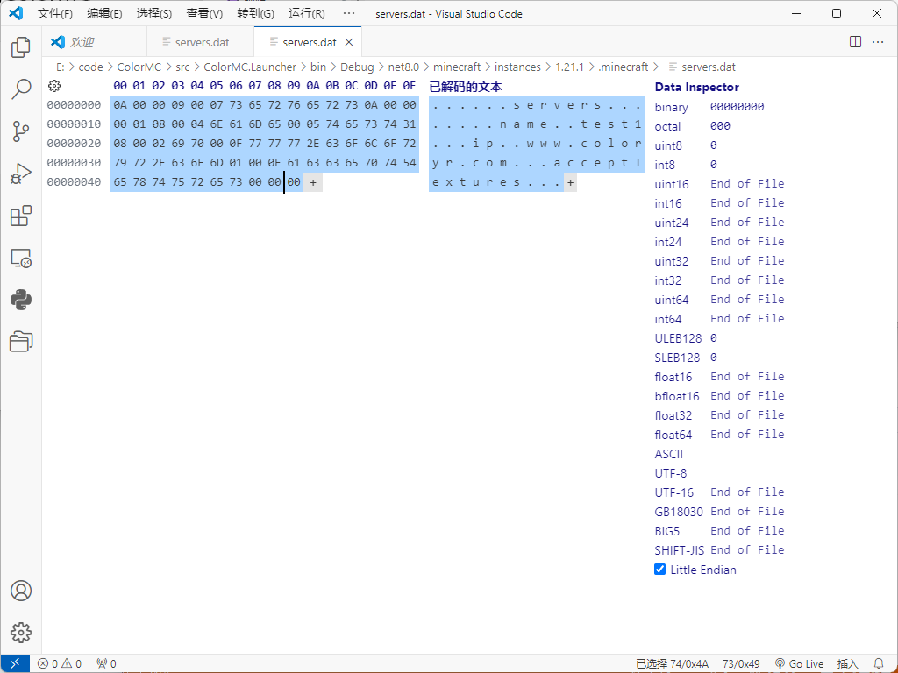
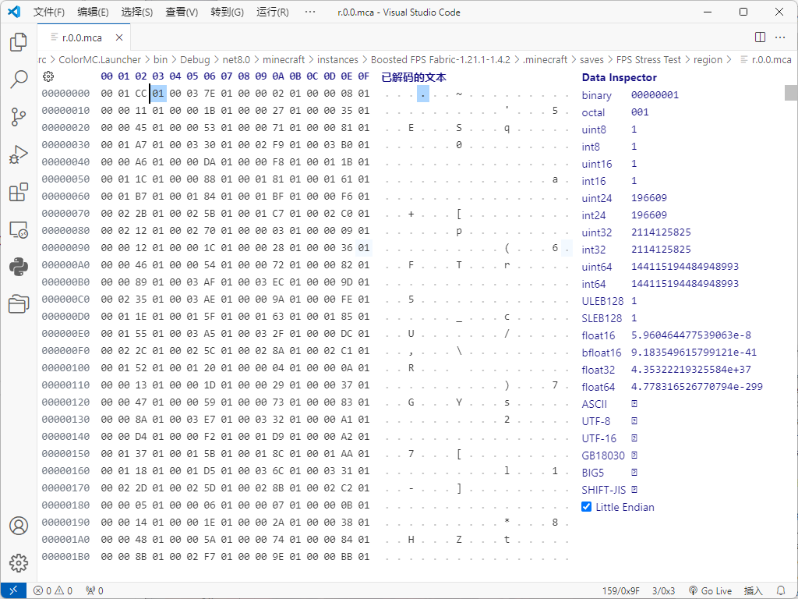
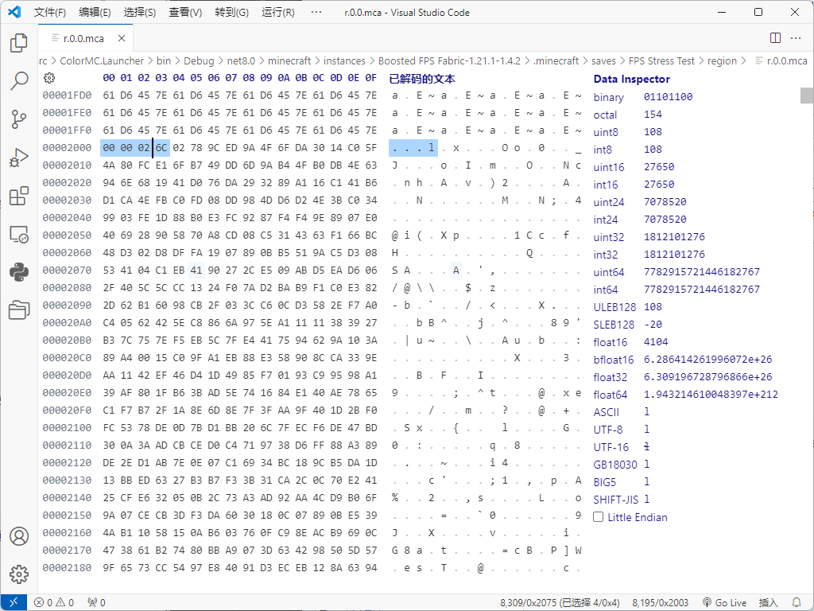

## NBT标签读取

在开始之前，你需要先了解[二进制](https://baike.baidu.com/item/%E4%BA%8C%E8%BF%9B%E5%88%B6/361457)和[十六进制](https://baike.baidu.com/item/%E5%8D%81%E5%85%AD%E8%BF%9B%E5%88%B6/4162457)  
还需要了解计算机中的各种[数据类型](https://www.runoob.com/cplusplus/cpp-data-types.html)  

NBT标签主要用于存档与数据储存，例如`level.dat`与`servers.dat`都是使用nbt标签进行存储  
存档与数据NBT标签储存方式不一样，但本质上是一样的  
结构文件`.litematic`与`.schematic`都是使用NBT标签进行存储的  
因此NBT标签使用的地方基本都与存档相关

### NBT数据压缩
每一个NBT标签文件都会有一个压缩方式，在开头的前几个字节说明  
```
1F 8B
```
表示使用了Gzip的方式进行压缩
```
78 01
或
78 9C
或
78 DA
```
表示使用了Zlib方式进行压缩  
若使用了压缩方式，则需要使用对应的压缩库对数据进行解压操作，才能开始读NBT标签数据

### NBT结构
每个NBT标签都会有个1byte的类型在前面说明，后面跟着2byte的名称长度，后面才是数据  
目前的类型有
- 0x00 End 表示结束标签
- 0x01 Byte 表示长度为1的整形标签
- 0x02 Short 表示长度为2的整形标签
- 0x03 Int 表示长度为4的整形标签
- 0x04 Long 表示长度为8的整形标签
- 0x05 Float 表示长度为4的浮点型标签
- 0x06 Double 表示长度为8的浮点型标签
- 0x07 ByteArray 表示Byte数组标签
- 0x08 String 表示字符串标签
- 0x09 List 表示某种类型的数组标签
- 0x0A Compound 表示键值对的标签
- 0x0B IntArray 表示Int数组标签
- 0x0C LongArray 表示Long数组标签

End型
```
00
```
这个NBT标签只有1byte长度的数据，表示NBT结束

Byte型
```
01 00 02 65 78 7f
```
其中的`00 02`表示标签名称长度`65 78`表示名称  
`7f`是一个byte数据，范围-128到127，这里的值是127  

~~此外还有一个延申标签，Boolean标签，0表示true，1表示false~~

Short型
```
02 00 02 65 78 00 08
```
其中的`00 02`表示标签名称长度`65 78`表示名称  
`00 08`拼接成为一个short数据，高位在前，范围-32,768到32,767，这里是的值是8  

Int型
```
03 00 02 65 78 00 00 00 08
```
其中的`00 02`表示标签名称长度`65 78`表示名称  
`00 00 00 08`拼接成为一个int数据，高位在前，范围-2,147,483,648到2,147,483,647，这里是的值是8  

Long型
```
04 00 02 65 78 00 00 00 00 00 00 00 08
```
其中的`00 02`表示标签名称长度`65 78`表示名称  
`00 00 00 08`拼接成为一个int数据，高位在前，范围-9,223,372,036,854,775,808到9,223,372,036,854,775,807，这里是的值是8  

Float型
```
05 00 02 65 78 41 00 00 00
```
其中的`00 02`表示标签名称长度`65 78`表示名称  
`41 00 00 00`拼接成为一个float数据，高位在前，范围是单精度，这里是的值是8.0f  

Double型
```
06 00 02 65 78 40 20 00 00 00 00 00 00
```
其中的`00 02`表示标签名称长度`65 78`表示名称  
`40 20 00 00 00 00 00 00`拼接成为一个double数据，高位在前，范围是双精度，这里是的值是8.0d  

ByteArray型
```
07 00 02 65 78 00 00 00 03 01 09 03
```
其中的`00 02`表示标签名称长度`65 78`表示名称  
`00 00 00 03`表示这个数组的长度，这里的值为3  
`01 09 03`表示数组中的数据

String型
```
08 00 02 65 78 00 04 74 65 73 74
```
其中的`00 02`表示标签名称长度`65 78`表示名称  
`00 04`表示这个字符串的长度，这里的值为4  
`74 65 73 74`表示字符串中的数据`test`  
字符串编码一般使用`UTF-8`

List型
```
09 00 02 65 78 01 00 00 00 03 01 01 01
```
其中的`00 02`表示标签名称长度`65 78`表示名称  
`01`表示这个数组的类型，这里表示Byte类型
`00 00 00 03`表示这个数组的长度，这里的值为3  
`01 01 01`表示数组中的数据

Compound型
```
0A 00 02 65 78 03 00 02 61 31 00 00 00 01 01 00 02 61 32 02 00
```
其中的`00 02`表示标签名称长度`65 78`表示名称  
`03`表示这个子NBT标签的类型，这里表示Int类型
  `00 02`表示子标签名称长度`61 31`表示子标签名称  
  `00 00 00 01`表示子标签的数据，这里的值为1  
`01`表示这个子Byte标签的类型，这里表示Byte类型
  `00 02`表示子标签名称长度`61 32`表示子标签名称  
  `02`表示子标签的数据，这里的值为2  
最后一个`00`表示这个Compound标签结束(END标签)  
因此该标签是一个字典结构
- Compound(65 78)
 - Int(61 31) : 1
 - Byte(61 32) : 2

IntArray型
```
0B 00 02 65 78 00 00 00 03 00 00 00 01 00 00 00 02 00 00 00 03
```
和ByteArray型一样的结构

LongArray型
```
0C 00 02 65 78 00 00 00 03 00 00 00 00 00 00 00 01 00 00 00 00 00 00 00 02 00 00 00 00 00 00 00 03
```
和ByteArray型一样的结构

### NBT读取示例
例如一个servers.dat的文件
  
该NBT文件没有进行压缩，可以直接读取  
首字节`0A`表示这是一个`Compound标签`  
然后读取`00 00`表示该标签没有名字  
紧接着`09`表示`List标签`，往后标签名字为`servers`  
接着是`0A`表示这个`List标签`里面的类型为`Compound型`  
再往后`00 00 00 01`表示长度为1  
然后后面就是`Compound标签`的内容依次解析了

### 地图NBT标签
地图使用Region的方式进行储存，也就是MCA文件方式进行储存  
一个Region存有许多的区块数据，一般是1024个区块  
这里需要搞清楚`方块坐标`，`区块坐标`，`区块文件坐标(MCA坐标)`  
其转换公式为
```
方块坐标 -> 区块坐标
x >> 4, z >> 4
区块坐标 -> MCA坐标
x >> 5, z >> 5
```

然后我们打开一个MCA文件  
  

它的前4096字节是区块偏移地址  
也就是说1024个区块的所有NBT标签具体位置在这个文件的那个位置  
```
00 01 CC 01
```
其中的`00 01 CC`表示偏移，后面的`01`表示占用文件的数量  
这个数量表示的是这个区块的地图数据占用多少个扇区(4096)
其NBT标签会从`460 * 4096`这个位置开始  
再往后4096字节是区块的时间戳，4字节一个区块  

**第一个区块所在的扇区不一定是在第一个扇区，这个是根据区块生成的时候来的**

然后到8192字节后面的区块数据  
来到第一个扇区数据
  
关注前5个字节  
```
00 00 02 6C 02
```
`00 00 02 6C`表示这个区块的字节数  
`02`表示数据压缩类型  
```
01 GZip
02 Zlib
03 不压缩
04 LZ4(1.20.5新增)
EF 自定义(1.20.5新增)
```
之后往下就是区块的NBT数据了，根据NBT的方式读就行  