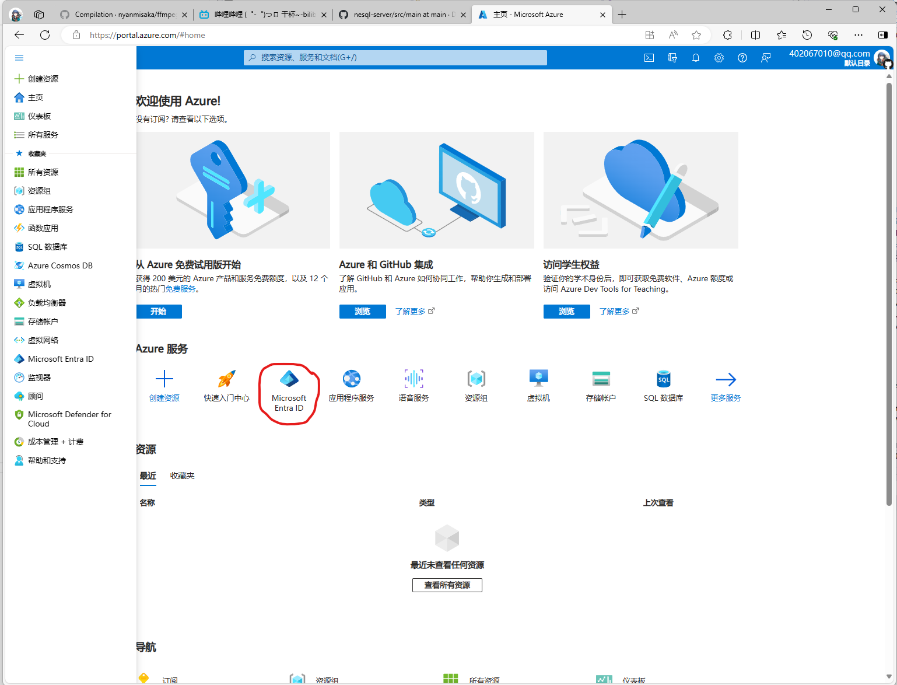
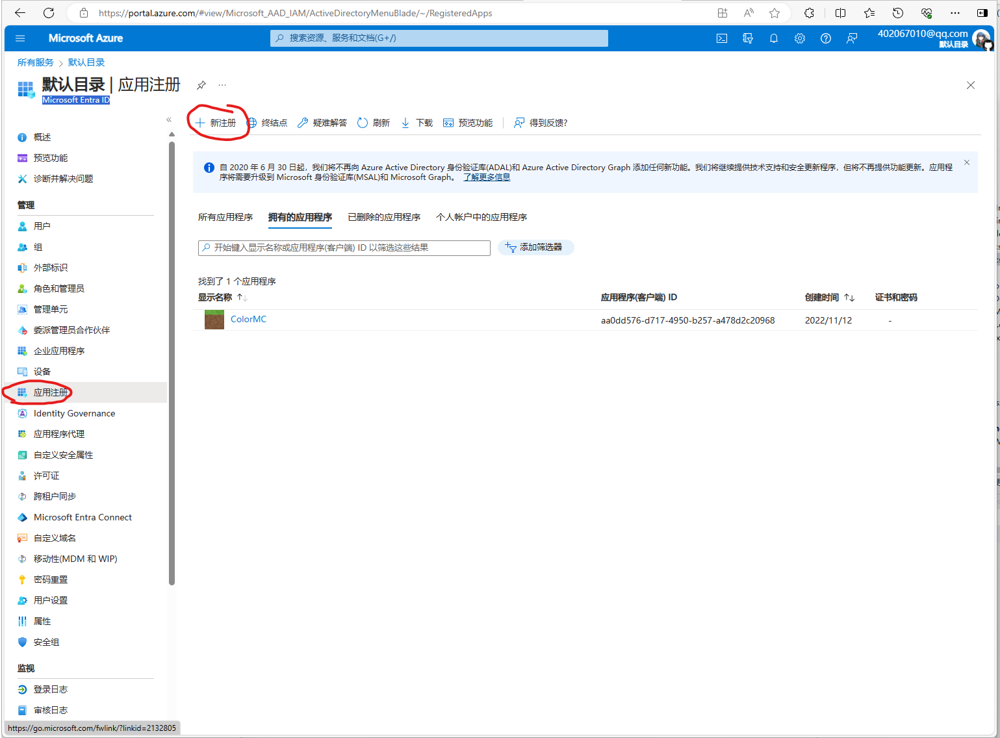
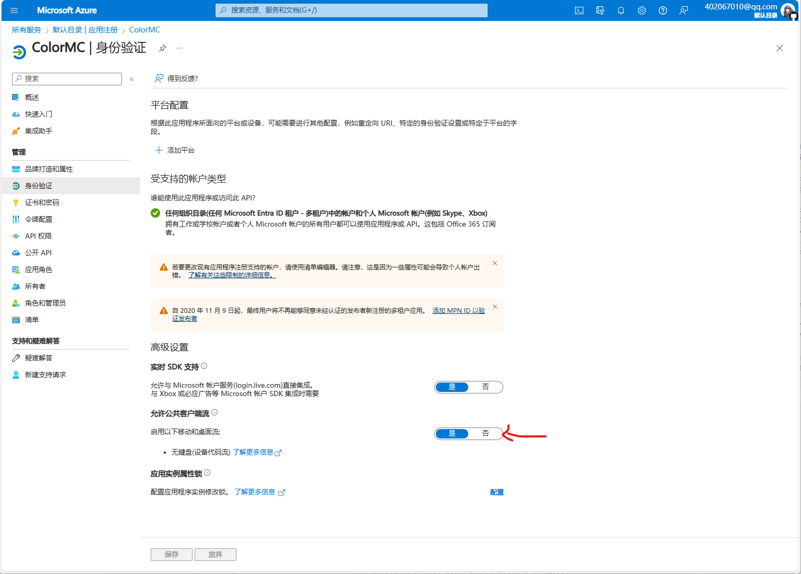

# Minecraft启动器制作教程

**本教程只适用于JAVA版**

## 目录

- [前言](#前言)

## 前言

本教授是由Coloryr编写的关于[Minecraft](https://minecraft.net/)JAVA版本的启动器教程  
教程适用于JAVA8开始的游戏版本，及1.7.10以上的版本

在编写启动器之前，需要你掌握一门编程语言，并且有自己的思考能力，能够自己解决问题  
**我在这里不推荐任何一个新手去编写启动器**  
因为难度非常大，并且需要花费非常多的时间，只适合有能力，有闲时的人去这么做  
如果你没有任何知识，一定要去做一个启动器，那么可以先去学习编程语言，了解编程思想，再来看本教程  
**本教程不附带任何源码**  
本教程只做文字及图表说明，实际代码需要你自己去完成  

### 工具说明

本教程大部分地方都是用了[Postman](https://www.postman.com/)工具发起请求

## 游戏文件

在启动游戏之前，我们需要获取游戏文件，Minecraft游戏文件（下面简称文件）由几部分组成  
- 游戏核心(Minecraft.jar)
- 运行库(xxxx-xxx-xxx.jar)
- 资源文件(SHA1值的文件)

### 下载地址获取
每一个游戏版本所需要的文件都不一样，那么要怎么知道是那些文件呢？  
mojang帮你整理好了，或者说我们启动器在启动的时候需要获取这个文件  
首先需要请求获取版本列表，网址为：https://launchermeta.mojang.com/mc/game/version_manifest_v2.json  
```
GET https://launchermeta.mojang.com/mc/game/version_manifest_v2.json
```
```json
{
    "latest": {
        "release": "1.20.4",
        "snapshot": "24w09a"
    },
    "versions": [
        {
            "id": "24w09a",
            "type": "snapshot",
            "url": "https://piston-meta.mojang.com/v1/packages/dc6fd93b4a4856000343557281a47c27192cdd3b/24w09a.json",
            "time": "2024-02-28T13:17:23+00:00",
            "releaseTime": "2024-02-28T12:38:12+00:00",
            "sha1": "dc6fd93b4a4856000343557281a47c27192cdd3b",
            "complianceLevel": 1
        },
        ....
    ]
}
```
其中`latest`为最新版号
```json
{
    "latest": {
        "release": 最新正式版,
        "snapshot": 最新预览版
    }
}
```
剩下的`versions`为游戏版本
```json
{
    "id": 游戏版本,
    "type": 类型 有快照snapshot 正式版release 旧测试版old_beta 旧内测版old_alpha,
    "url": 元数据地址,
    "time": 时间,
    "releaseTime": 发布时间,
    "sha1": 元数据SHA1,
    "complianceLevel": 1
}
```
然后选择一个版本，比如`1.20.4`，获取其元数据
```
GET https://piston-meta.mojang.com/v1/packages/8bcd47def18efee744bd0700e86ab44a96ade21f/1.20.4.json
```
```json
{
    "arguments": {
        "game": [
            "--username",
            "${auth_player_name}",
            ...
            {
                "rules": [
                    {
                        "action": "allow",
                        "features": {
                            "is_quick_play_realms": true
                        }
                    }
                ],
                "value": [
                    "--quickPlayRealms",
                    "${quickPlayRealms}"
                ]
            }
        ],
        "jvm": [
            ...
            {
                "rules": [
                    {
                        "action": "allow",
                        "os": {
                            "arch": "x86"
                        }
                    }
                ],
                "value": "-Xss1M"
            },
            "-Djava.library.path=${natives_directory}",
            "-Djna.tmpdir=${natives_directory}",
            "-Dorg.lwjgl.system.SharedLibraryExtractPath=${natives_directory}",
            "-Dio.netty.native.workdir=${natives_directory}",
            "-Dminecraft.launcher.brand=${launcher_name}",
            "-Dminecraft.launcher.version=${launcher_version}",
            "-cp",
            "${classpath}"
        ]
    },
    "assetIndex": {
        "id": "12",
        "sha1": "518a69b460cb49a5547cea4290d343116a5d2eb8",
        "size": 436400,
        "totalSize": 627004279,
        "url": "https://piston-meta.mojang.com/v1/packages/518a69b460cb49a5547cea4290d343116a5d2eb8/12.json"
    },
    "assets": "12",
    "complianceLevel": 1,
    "downloads": {
        "client": {
            "sha1": "fd19469fed4a4b4c15b2d5133985f0e3e7816a8a",
            "size": 24445539,
            "url": "https://piston-data.mojang.com/v1/objects/fd19469fed4a4b4c15b2d5133985f0e3e7816a8a/client.jar"
        },
        "client_mappings": {
            "sha1": "be76ecc174ea25580bdc9bf335481a5192d9f3b7",
            "size": 8897012,
            "url": "https://piston-data.mojang.com/v1/objects/be76ecc174ea25580bdc9bf335481a5192d9f3b7/client.txt"
        },
        "server": {
            "sha1": "8dd1a28015f51b1803213892b50b7b4fc76e594d",
            "size": 49150256,
            "url": "https://piston-data.mojang.com/v1/objects/8dd1a28015f51b1803213892b50b7b4fc76e594d/server.jar"
        },
        "server_mappings": {
            "sha1": "c1cafe916dd8b58ed1fe0564fc8f786885224e62",
            "size": 6797462,
            "url": "https://piston-data.mojang.com/v1/objects/c1cafe916dd8b58ed1fe0564fc8f786885224e62/server.txt"
        }
    },
    "id": "1.20.4",
    "javaVersion": {
        "component": "java-runtime-gamma",
        "majorVersion": 17
    },
    "libraries": [
        ...
        {
            "downloads": {
                "artifact": {
                    "path": "org/lwjgl/lwjgl-tinyfd/3.3.2/lwjgl-tinyfd-3.3.2-natives-windows-x86.jar",
                    "sha1": "0c1dfa1c438e0262453e7bf625289540e5cbffb2",
                    "size": 111596,
                    "url": "https://libraries.minecraft.net/org/lwjgl/lwjgl-tinyfd/3.3.2/lwjgl-tinyfd-3.3.2-natives-windows-x86.jar"
                }
            },
            "name": "org.lwjgl:lwjgl-tinyfd:3.3.2:natives-windows-x86",
            "rules": [
                {
                    "action": "allow",
                    "os": {
                        "name": "windows"
                    }
                }
            ]
        },
        ...
        {
            "downloads": {
                "artifact": {
                    "path": "org/slf4j/slf4j-api/2.0.7/slf4j-api-2.0.7.jar",
                    "sha1": "41eb7184ea9d556f23e18b5cb99cad1f8581fc00",
                    "size": 63635,
                    "url": "https://libraries.minecraft.net/org/slf4j/slf4j-api/2.0.7/slf4j-api-2.0.7.jar"
                }
            },
            "name": "org.slf4j:slf4j-api:2.0.7"
        }
    ],
    "logging": {
        "client": {
            "argument": "-Dlog4j.configurationFile=${path}",
            "file": {
                "id": "client-1.12.xml",
                "sha1": "bd65e7d2e3c237be76cfbef4c2405033d7f91521",
                "size": 888,
                "url": "https://piston-data.mojang.com/v1/objects/bd65e7d2e3c237be76cfbef4c2405033d7f91521/client-1.12.xml"
            },
            "type": "log4j2-xml"
        }
    },
    "mainClass": "net.minecraft.client.main.Main",
    "minimumLauncherVersion": 21,
    "releaseTime": "2023-12-07T12:56:20+00:00",
    "time": "2023-12-07T12:56:20+00:00",
    "type": "release"
}
```

可以看到，获取到这个文件后就能可以在脱离资源文件启动游戏了

- arguments启动参数  
`arguments`为游戏启动时所需的JVM与游戏参数  
`arguments.game`为游戏参数，`arguments.jvm`为JVM参数，其中有些参数是一个object  
```json
{
    "rules": [
        {
            "action": "allow",
            "features": {
                "has_custom_resolution": true
            }
        }
    ],
    "value": [
        "--width",
        "${resolution_width}",
        "--height",
        "${resolution_height}"
    ]
}
```
这表示这是一个可选参数，`rules`为生效所需的条件，`rules.action`是生效的方向`allow`表示条件满足生效，`value`为附加的参数  
在这些游戏参数中，由`${}`包裹起来的东西，是启动器在启动前需要换掉的  
- assetIndex资源文件元信息  
`assetIndex`为资源元信息，游戏所需的资源文件需要通过这个元信息来获取
```json
{
    "id": 版本号 低版本直接叫1.12.2 高版本就只有数字 1 2 3 ...,
    "sha1": 元信息SHA1值,
    "size": 文件大小,
    "totalSize": 资源文件总大小,
    "url": 获取网址
},
```
- downloads核心下载  
`downloads`为游戏核心下载地址
```json
{
    //客户端地址
    "client": {
        "sha1": "fd19469fed4a4b4c15b2d5133985f0e3e7816a8a",
        "size": 24445539,
        "url": "https://piston-data.mojang.com/v1/objects/fd19469fed4a4b4c15b2d5133985f0e3e7816a8a/client.jar"
    },
    //客户端混淆表
    "client_mappings": {
        "sha1": "be76ecc174ea25580bdc9bf335481a5192d9f3b7",
        "size": 8897012,
        "url": "https://piston-data.mojang.com/v1/objects/be76ecc174ea25580bdc9bf335481a5192d9f3b7/client.txt"
    },
    //服务端地址
    "server": {
        "sha1": "8dd1a28015f51b1803213892b50b7b4fc76e594d",
        "size": 49150256,
        "url": "https://piston-data.mojang.com/v1/objects/8dd1a28015f51b1803213892b50b7b4fc76e594d/server.jar"
    },
    //服务端混淆表
    "server_mappings": {
        "sha1": "c1cafe916dd8b58ed1fe0564fc8f786885224e62",
        "size": 6797462,
        "url": "https://piston-data.mojang.com/v1/objects/c1cafe916dd8b58ed1fe0564fc8f786885224e62/server.txt"
    }
}
```
通过这个网址下载到的jar，就是游戏核心jar  
`javaVersion`为游戏启动所需的java版本`javaVersion.majorVersion`所表示的就是最低要求的JAVA版本号，低于该版本号将无法启动
- libraries运行库    
`libraries`为游戏启动所需的运行库列表
```json
{
    //下载地址
    "downloads": {
        "artifact": {
            "path": "ca/weblite/java-objc-bridge/1.1/java-objc-bridge-1.1.jar",
            "sha1": "1227f9e0666314f9de41477e3ec277e542ed7f7b",
            "size": 1330045,
            "url": "https://libraries.minecraft.net/ca/weblite/java-objc-bridge/1.1/java-objc-bridge-1.1.jar"
        }
    },
    //文件名字
    "name": "ca.weblite:java-objc-bridge:1.1",
    //是否使用，这个用于区分系统
    "rules": [
        {
            "action": "allow",
            "os": {
                "name": "osx"
            }
        }
    ]
}
```
在lwjgl2的时候，这个运行库还有这种格式  
```json
{
    "downloads": {
        //native库
        "classifiers": {
            "natives-linux": {
                "path": "org/lwjgl/lwjgl/lwjgl-platform/2.9.2-nightly-20140822/lwjgl-platform-2.9.2-nightly-20140822-natives-linux.jar",
                "sha1": "d898a33b5d0a6ef3fed3a4ead506566dce6720a5",
                "size": 578539,
                "url": "https://libraries.minecraft.net/org/lwjgl/lwjgl/lwjgl-platform/2.9.2-nightly-20140822/lwjgl-platform-2.9.2-nightly-20140822-natives-linux.jar"
            },
            "natives-osx": {
                "path": "org/lwjgl/lwjgl/lwjgl-platform/2.9.2-nightly-20140822/lwjgl-platform-2.9.2-nightly-20140822-natives-osx.jar",
                "sha1": "79f5ce2fea02e77fe47a3c745219167a542121d7",
                "size": 468116,
                "url": "https://libraries.minecraft.net/org/lwjgl/lwjgl/lwjgl-platform/2.9.2-nightly-20140822/lwjgl-platform-2.9.2-nightly-20140822-natives-osx.jar"
            },
            "natives-windows": {
                "path": "org/lwjgl/lwjgl/lwjgl-platform/2.9.2-nightly-20140822/lwjgl-platform-2.9.2-nightly-20140822-natives-windows.jar",
                "sha1": "78b2a55ce4dc29c6b3ec4df8ca165eba05f9b341",
                "size": 613680,
                "url": "https://libraries.minecraft.net/org/lwjgl/lwjgl/lwjgl-platform/2.9.2-nightly-20140822/lwjgl-platform-2.9.2-nightly-20140822-natives-windows.jar"
            }
        }
    },
    "extract": {
        "exclude": [
            "META-INF/"
        ]
    },
    "name": "org.lwjgl.lwjgl:lwjgl-platform:2.9.2-nightly-20140822",
    "natives": {
        "linux": "natives-linux",
        "osx": "natives-osx",
        "windows": "natives-windows"
    },
    "rules": [
        {
            "action": "allow",
            "os": {
                "name": "osx"
            }
        }
    ]
}
```
这表示下载的jar里面含有`native`库，需要进行jar解压，将jar通过zip解压后，可以得到一个文件目录结构
```
- \
  - liblwjgl.so
  - liblwjgl64.so
  - libopenal.so
  - libopenal64.so
```
这些`native`库都需要解压出来，放在一个文件夹下面，如果不这样做，游戏将无法启动
- logging日志附加选项  
`logging`用于在JVM参数附加防止`log4j`的[0day漏洞](https://nvd.nist.gov/vuln/detail/CVE-2021-44228)，可以不用  
剩下的我放在一起
```json
{
    "assets": 资源文件号,
    "id": 游戏版本,
    "mainClass": 主类,
    "minimumLauncherVersion": 启动器版本,
    "releaseTime": 发布时间,
    "time": 更新时间,
    "type": 发布类型
}
```

然后是资源文件的获取，从上面游戏版本元数据中，请求资源文件的元数据
```
GET https://piston-meta.mojang.com/v1/packages/518a69b460cb49a5547cea4290d343116a5d2eb8/12.json
```
```json
{
    "objects": {
        "icons/icon_128x128.png": {
            "hash": "b62ca8ec10d07e6bf5ac8dae0c8c1d2e6a1e3356",
            "size": 9101
        },
        "icons/icon_16x16.png": {
            "hash": "5ff04807c356f1beed0b86ccf659b44b9983e3fa",
            "size": 781
        },
        "icons/icon_256x256.png": {
            "hash": "8030dd9dc315c0381d52c4782ea36c6baf6e8135",
            "size": 19642
        },
        "icons/icon_32x32.png": {
            "hash": "af96f55a90eaf11b327f1b5f8834a051027dc506",
            "size": 2063
        },
        ...
    }
}
```
这一堆列表就是资源文件了
```json
{
    //名字
    "icons/icon_128x128.png": {
        //哈希值
        "hash": "b62ca8ec10d07e6bf5ac8dae0c8c1d2e6a1e3356",
        //大小
        "size": 9101
    },
}
```

### 文件储存结构
知道文件从哪里获取之后，就需要找个地方存起来  
 -元数据  
我推荐是本地存一份，然后启动前请求一次，检测SHA1值，然后判断有无版本更新  
资源文件的元数据需要存起来
- 游戏核心  
游戏核心丢那里都行我习惯放在`/libraries/net/minecraft/client/client-xxx.jar`
- 运行库  
运行库的放置也是可以随便放，但是我更喜欢按结构来放  
比如，一个运行库的名字为`ca.weblite:java-objc-bridge:1.1`  
那么我会放在`/libraries/ca/weblite/java-objc-bridge/1.1/java-objc-bridge-1.1.jar`
- 资源文件  
资源文件需要有点讲究的放，一般资源文件都是以下结构
```
- assets \
  - indexes \
    - 1.12.json
    - 12.json
  - objects \
    - 00 \
      - 000c82756fd54e40cb236199f2b479629d0aca2f
      ...
    - 0a \
      - 0a0bc1ffa05ac5ff00eb2b1bb9093818a35b85b9
    ...
  - skin \
    - 00 \
      - xxxxxx
      ...
    - 01 \
      - xxxxx
```
也就是分为三类，然后取SHA1前两位做一个文件夹，然后再以文件名为SHA1值储存

到此所有游戏文件就获取结束了

## 登录与启动

游戏启动前，需要玩家登录账户，而账户又分为很多种  
总体分为新版OAuth登录与旧方式登录

目前登录微软账户需要使用[新版OAuth流程](https://wiki.vg/Zh:Microsoft_Authentication_Scheme)
```
OAuth 微软登录
->
XBox Xbox验证
->
XSTS 好像是Xbox附属验证
->
Token 客户端密匙
->
Profile 账户信息
```
走完这套流程后就能启动游戏了

OAuth需要去申请一个client_key才能使用  
注册一个Azure 账户
点击`Microsoft Entra ID`  
  
注册一个应用  
  
然后按照下面设置  
  
  
复制`客户端ID`，后面要用到  

然后开始登录，准备一个HttpClient，开始请求

### OAuth登录新账户

- OAuth  
```
POST https://login.microsoftonline.com/consumers/oauth2/v2.0/devicecode
application/x-www-form-urlencoded
client_id=你的客户端ID&scope=XboxLive.signin offline_access
```
结果返回
```json
{
    "user_code": "5MTFVRR7",
    "device_code": "BAQABIQEAAADnfolhJpSnRYBxxxxA",
    "verification_uri": "https://www.microsoft.com/link",
    "expires_in": 900,
    "interval": 5,
    "message": "To sign in, use a web browser to open the page https://www.microsoft.com/link and enter the code 5MTFVRR7 to authenticate."
}
```
其中`user_code`需要展示出去，`device_code`需要储存，然后用户点击`verification_uri`链接，填写`user_code`进行登录  
然后在此期间，需要定时`interval`秒请求
```
POST https://login.microsoftonline.com/consumers/oauth2/v2.0/token
application/x-www-form-urlencoded
client_id=你的客户端ID&grant_type=urn:ietf:params:oauth:grant-type:device_code&code=储存的device_code
```
结果返回
```json
{
    "error": "authorization_pending",
    "error_description": "AADSTS70016: Pending end-user authorization.\r\nTrace ID: aff0fcc8-257a-400c-a275-bba4a6a72600\r\nCorrelation ID: f820aa6d-9dd7-4fab-8e68-5521013aea2e\r\nTimestamp: 2019-04-04 16:04:58Z",
    "error_codes": [
        70016
    ],
    "timestamp": "2019-04-04 16:04:58Z",
    "trace_id": "aff0fcc8-257a-400c-a275-bba4a6a72600",
    "correlation_id": "f820aa6d-9dd7-4fab-8e68-5521013aea2e"
}
```
表示用户还没有登录成功
```json
{
    "token_type": "Bearer",
    "scope": "XboxLive.signin offline_access",
    "expires_in": 3600,
    "ext_expires_in": 3600,
    "access_token": "eyJ0eXAiOiJxxxx",
    "refresh_token": "OAQABAAAAAADCoxxxx",
    "id_token": "eyJ0eXAiOixxxx"
}
```
表示用户已经登录成功了
`access_token`用与后续请求，`refresh_token`用于刷新用户密钥，也就是免再次登录
- Xbox登录
```
POST https://user.auth.xboxlive.com/user/authenticate
application/json
{
    "Properties": {
        "AuthMethod": "RPS",
        "SiteName": "user.auth.xboxlive.com",
        "RpsTicket": "d=那个access_token"
    },
    "RelyingParty": "http://auth.xboxlive.com",
    "TokenType": "JWT"
}
```
结果返回
```json
{
   "IssueInstant":"2020-12-07T19:52:08.4463796Z",
   "NotAfter":"2020-12-21T19:52:08.4463796Z",
   "Token": "token",
   "DisplayClaims":{
        "xui":[
            {
                "uhs": "uhs"
            }
        ]
   }
}
```
其中`Xbox.Token`需要保存
- XSTS
```
POST https://xsts.auth.xboxlive.com/xsts/authorize
application/json
{
    "Properties": {
        "SandboxId": "RETAIL",
        "UserTokens": [
            "上面储存的Xbox.Token"
        ]
    },
    "RelyingParty": "rp://api.minecraftservices.com/",
    "TokenType": "JWT"
}
```
结果返回
```json
{
   "IssueInstant":"2020-12-07T19:52:09.2345095Z",
   "NotAfter":"2020-12-08T11:52:09.2345095Z",
   "Token": "token",
   "DisplayClaims":{
        "xui":[
            {
                "uhs": "uhs"
            }
        ]
    }
}
```
其中`XSTS.Token`与`XSTS.uhs`需要保存
- Token
```
POST https://api.minecraftservices.com/authentication/login_with_xbox
application/json
{
    "identityToken": "XBL3.0 x=上面的XSTS.uhs;上面的XSTS.Token"
}
```
结果返回
```
{
    "username" : xxx,
    "roles" : [ ],
    "access_token" : "minecraft access token",
    "token_type" : "Bearer",
    "expires_in" : 86400
}
```
其中`access_token`需要保存
- Profile
```
GET https://api.minecraftservices.com/minecraft/profile
Headers需要加上 Authorization: Bearer 上面的access_token
```
结果返回
```
{
  "id" : "cced95f30a844377b8c18e60cf1b3fea",
  "name" : "Color_yr",
  "skins" : [ {
    "id" : "89fe094b-6511-4117-b9d4-46cf5ba9d99c",
    "state" : "ACTIVE",
    "url" : "http://textures.minecraft.net/texture/be9b4b65c81c47cda6effe173a90abc32864e4b147d37a7a3854287393c48bec",
    "textureKey" : "be9b4b65c81c47cda6effe173a90abc32864e4b147d37a7a3854287393c48bec",
    "variant" : "SLIM"
  } ],
  "capes" : [ {
    "id" : "5af20372-79e0-4e1f-80f8-6bd8e3135995",
    "state" : "ACTIVE",
    "url" : "http://textures.minecraft.net/texture/2340c0e03dd24a11b15a8b33c2a7e9e32abb2051b2481d0ba7defd635ca7a933",
    "alias" : "Migrator"
  } ],
  "profileActions" : { }
}
```
这里就是用户信息了，只需要取出`id`在后面使用  
注意`Bearer`后面是带一个空格的，不要漏了

### OAuth刷新密钥
该步骤需要OAtuh步骤中的，`refresh_token`，然后请求
```
POST https://login.microsoftonline.com/consumers/oauth2/v2.0/token
application/x-www-form-urlencoded
client_id=你的客户端ID&grant_type=refresh_token&refresh_token=之前获取的refresh_token
```
返回结果和初次OAuth登录一样，同样需要重新存储`refresh_token`，也就是登录一次`refresh_token`要刷新一次  
后面的步骤就是一模一样的了

### 第三方登录
例如[统一通行证Nide8](https://login.mc-user.com:233/)和[littleskin皮肤站](https://littleskin.cn/)这种外置登录  
都是用了旧版登录方式

旧版登录方式很简单，只需要请求
```
POST http://验证地址/authserver/authenticate
application/json
{
    // 可选
    "agent": {	
        // 启动器名称
        "name": "ColorMC",	
        // 启动器版本
        "version": 1.25	
    },
    "username": "用户名",
    "password": "密码",
    // 客户端UUID
    "clientToken": "XXXXXXXX-XXXX-XXXX-XXXXXXXXXXXXXXXX"
}
```
**注意，该部分为明文传输，请一定要使用https而不是http**
结果返回
```json
{
    // 访问令牌
    "accessToken": "XXXXXXXXXXXXXXXXXXXXXXXXXXXXXXXX",	
    // 客户端UUID
    "clientToken": "XXXXXXXX-XXXX-XXXX-XXXXXXXXXXXXXXXX",	
    "selectedProfile": {
        "id": "XXXXXXXXXXXXXXXXXXXXXXXXXXXXXXXX",	//玩家UUID
        "name": "游戏ID"
    }
}
```
`accessToken`是需要保存的东西，建议`clientToken`不为空的发送到服务器，方便后续操作

### 游戏启动

游戏启动需要JAVA，JAVA的下载与安装不在该教程范围内
启动前需要检查所有游戏文件，运行库，资源文件，游戏核心等，然后开始拼接启动参数  
启动参数主要由几部分组成
```
javaw.exe(其他操作系统为java) JVM参数 主类 游戏参数
```
JVM参数 主类 游戏参数 都能在游戏元数据中获取，加入最大内存与最小内存等，然后得到下面的结果
```
javaw.exe
-XX:HeapDumpPath=MojangTricksIntelDriversForPerformance_javaw.exe_minecraft.exe.heapdump
-Xss1M
-Xmx4G 
-Xms512M
-Djna.tmpdir=${natives_directory}
-Dorg.lwjgl.system.SharedLibraryExtractPath=${natives_directory}
-Dio.netty.native.workdir=${natives_directory}
-Dminecraft.launcher.brand=${launcher_name}
-Dminecraft.launcher.version=${launcher_version}
-cp
${classpath}
net.minecraft.client.main.Main
--username"
${auth_player_name}
--version
${version_name}
--gameDir
${game_directory}
--assetsDir
${assets_root}
--assetIndex
${assets_index_name}
--uuid
${auth_uuid}
--accessToken
${auth_access_token}
--clientId
${clientid}
--xuid
${auth_xuid}
--userType
${user_type}
--versionType
${version_type}
```
然后还要把参数中的各项`${}`东西换掉  
`${natives_directory}`->`Native`所在的目录  
`${launcher_name}`->启动器名字  
`${launcher_version}`->启动器版本
`${classpath}`->ClassPath
`${auth_player_name}`->用户名
`${version_name}`->版本号
`${game_directory}`->游戏目录，就是config啥的目录
`${assets_root}`->资源目录
`${assets_index_name}`->资源元数据名，不用带json 例如1.12.2，12
`${auth_uuid}`->用户UUID
`${auth_access_token}`->登录密钥
`${clientid}`->客户端ID（可以不换）
`${auth_xuid}`->不知道这是啥
`${user_type}`->账户类型，如果是正版登录就为msa，其他为mojang
`${version_type}`->游戏类型，就是发布版类型，填release好像也行
- ClassPath  
这是JVM所需的运行库引导，需要填绝对路径  
在游戏元数据中，已经获取到了所有的运行库，那么需要一个个的获取绝对路径填进来  
例如
```
E:\code\ColorMC\src\ColorMC.Launcher\bin\Release\net8.0\minecraft\libraries\com\cleanroommc\cleanroom\15.24.0.3028\cleanroom-15.24.0.3028.jar;E:\code\ColorMC\src\ColorMC.Launcher\bin\Release\net8.0\minecraft\libraries\org\lwjgl3\lwjgl3-glfw\3.3.4-27-CLEANROOM\lwjgl3-glfw-3.3.4-27-CLEANROOM.jar;E:\code\ColorMC\src\ColorMC.Launcher\bin\Release\net8.0\minecraft\libraries\org\lwjgl3\lwjgl3-jemalloc\3.3.4-27-CLEANROOM\lwjgl3-jemalloc-3.3.4-27-CLEANROOM.jar;E:\code\ColorMC\src\ColorMC.Launcher\bin\Release\net8.0\minecraft\libraries\org\lwjgl3\lwjgl3-openal\3.3.4-27-CLEANROOM\lwjgl3-openal-3.3.4-27-CLEANROOM.jar;
...
```
jar之间用`;`隔开，如果是Linux或者Unix操作系统，则需要使用`:`隔开  
将所有参数替换掉，按照那个启动参数启动新进程，就可以开启游戏了  

~~当然你也可以用JNI的方式启动，参数是一样的~~

## 模组加载器

## 附属资源