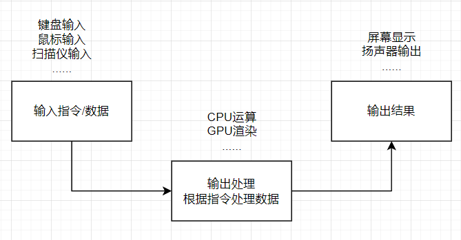
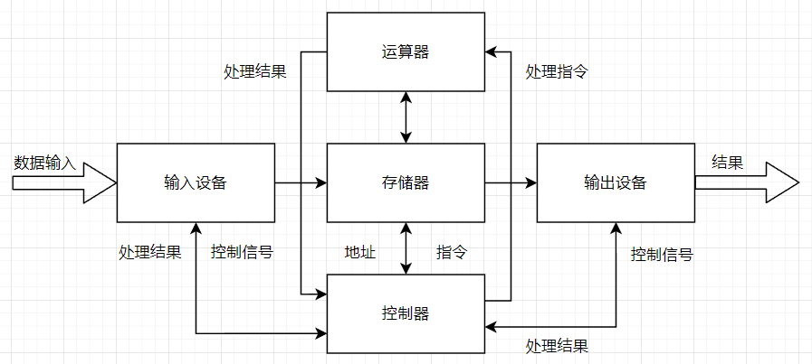

# 编程入门

目录
- [#计算机](#计算机)
- [#程序](#程序)
- [#二进制](#二进制)
- [#流程图](#流程图)
- [#函数](#函数)
- [#编程语言](#编程语言)

## 计算机

在开始学习编程之前，需要先知道什么叫计算机  
在百度百科的词条[计算机](https://baike.baidu.com/item/%E8%AE%A1%E7%AE%97%E6%9C%BA/140338)有定义  
```
计算机（computer）俗称电脑，是现代一种用于高速计算的电子计算机器，可以进行数值计算，又可以进行逻辑计算，还具有存储记忆功能。是能够按照程序运行，自动、高速处理海量数据的现代化智能电子设备。
```
~~然后后面还有一大串说明~~

简单来说，它是一个黑盒子，可以输入指令和数据，然后进行处理，输出并展现结果  


输入的类型可以有很多种，但必须包含指令，可以不用包含数据  
数据处理可以有多种方式，例如数学运算处理，将你输入的数据进行加减乘除  
输出的方式也有很多种，甚至可以同时以多种方式进行输出，某些情况可能会没有输出  

当然，计算机的结构也没有这么简单，主要来说包含两个部分
- 计算机硬件(hardware)
- 计算机软件(software)

### 计算机硬件

硬件简单理解就是你的买的电脑，无论是台式机还是笔记本，它只要能正常运行，都是计算机硬件  
`硬件部分`一般包含几个重要部分
- `中央处理器(CPU)` 例如i7-13700K，R9-9950x
- `随机存储器(RAM)` 例如DDR5内存
- `数据存储器(ROM)` 例如机械硬盘(HDD)，或者固态硬盘(SSD)，~~黑心笔记本用的固态颗粒(FLASH)~~
- `电源(Power)` 每台电脑都必须要有个电源才能工作

还有各类`输入/输出`设备
- `鼠标键盘` 现代计算机的输入都必备
- `显示器` 现代计算机输出标配
- `声音输出设备` 常见电脑都会有耳机孔
- `USB控制器` 可以让你接入设备

为了更好的体验还会同时装上
- `网卡` 可以让你上网冲浪
- `显卡` 可以让你在电脑上打游戏
- ~~`RGB控制器` More RGB!!!~~

主流计算机都会将各类输入输出设备或者其他设备等集中安装在一块电路板上，一般都把它叫`电脑主板`  
`主板`上可以更换CPU，PCIE设备(你的显卡插在上面)，接硬盘等  

虽然计算机硬件种类非常多，五花八门，但都不会缺少三样东西
- 计算单元
- 存储单元
- 输入输出接口

只要有这三样东西基本都可以算作计算机

### 计算机结构
现代计算机所遵循的基本结构为`冯·诺依曼结构`  
  

在这个结构里面，一般包含`输入设备`，`存储器`，`输出设备`，`运算器`和`控制器`  
`运算器`和`控制器`一般合在一起叫`CPU`  
存储器一般有`RAM`，`ROM`两种，同时存储器有个`物理地址`，所有存储器的`读写操作`必须通过`地址`来进行，`地址`相当于存储器的标号，就跟家里的门牌号作用类型，需要先找到对应的存储器，才能进行`读写操作`  
`CPU`的里面通常会有个自己的`小RAM`，叫做`寄存器`，通过往`寄存器`里面写`指令数据`，就可以控制`CPU`进行操作，`寄存器`也有地址，一般是固定的特殊地址  

`冯·诺依曼结构`一般流程为
- 输入的指令与数据会存在存储器里面
- 控制器会读取存储器里面的指令
- 根据指令让运算器取数据进行计算
- 然后运算器把结果返回存储器
- 输出设备将数据从存储器取出输出结果

至于数据是怎么存入存储器里面的，CPU为什么可以通过写寄存器来控制，可以去看，清华大学出版的[《计算机组成原理（第4版）》](https://baike.baidu.com/item/%E8%AE%A1%E7%AE%97%E6%9C%BA%E7%BB%84%E6%88%90%E5%8E%9F%E7%90%86%EF%BC%88%E7%AC%AC4%E7%89%88%EF%BC%89/55541138)  
剩下的知识感兴趣的可以去了解[冯·诺依曼结构](https://baike.baidu.com/item/%E5%86%AF%C2%B7%E8%AF%BA%E4%BE%9D%E6%9B%BC%E7%BB%93%E6%9E%84/9536784)  

剩余的计算机的其他硬件架构，历史等，这里不多细讲，因为这是属于计算机硬件的知识，本教程着重计算机软件相关的知识  

### 计算机软件

计算机软件就与计算机编程息息相关  

其实实际上，计算机并没有那么聪明，其硬件在接入电源后，若没有运行软件，则基本上什么都做不了  
计算机硬件很大程度上只是能决定计算机的性能，或者输入输出数据的类型方式等，并不能真正实现复杂运算  
当然计算机硬件本身是可以进行简单数据处理的，但也只能进行简单的计算，没有计算机软件，则不能算是真正的动起来  
计算机程序会将复杂的操作，转变为计算机能够执行的简单操作，从而达到处理复杂数据  
因此想要计算机去处理数据，就需要编写计算机软件，而编写过程就叫做`编程`  

计算机软件层次一般分为三个层次
- 底层程序
- 中间层程序
- 顶层程序

`底层程序`一般与硬件操作相关，例如将数据送给`存储器`，让`CPU`进行数据处理  
它们主要是操作计算机硬件的`寄存器`等硬件部分，主要是让硬件真正动起来  
例如让声卡发声，则需要底层程序操作声卡的`存储器`，往它的`寄存器`写入播放指令、音频格式通道等，然后再往它的`内存(缓冲区)`写入音频数据，这样声卡才能够发声  

`中间层程序`一般是`底层程序`的包装，也有可能是某些常用功能的包装，它们都是为顶层程序提供一个更广泛，更实用的接口，  
例如我们常见的文件操作系统`FAT32`、`EXT4`、`NTFS`等，都属于中间层，它给底层`存储器操作程序`进行了包装，提供了一个文件系统的广泛使用接口，只需要通过读写文件的方式，就能够往`存储器`里面读写数据，同时文件系统有文件管理器，则不需要我们再手动进行`存储器管理(磁盘管理)`操作，方便了顶层程序开发  
又例如一些数学库，它提供了幂指数(pow)，开方(sqrt)，取绝对值(abs)等

`顶层程序`一般是应用程序，用户通过调用`中间层`或者`底层`程序的接口，可以快速的开发自己想要的软件  
例如大部分计算机软件都是`顶层程序`，他们或多或少都调用了上一层的程序，然后加上自己的逻辑代码，实现了某种高级功能

在计算机软件中，除了三层程序，又将软件分为了
- 操作系统
- 内核驱动\驱动程序
- 应用程序
这样做能够更充分的发挥计算机的作用，提升开发效率  

`操作系统`，大部分电脑都会安装`Windows`操作系统，或者`Macos`操作系统，服务器上通常使用`Linux`操作系统等，这些操作系统一般是`底层程序`与`中间层程序`的集合，同时包含少量`顶层程序`，打包在一起，安装在计算机中  
`操作系统`一般实现了硬件的控制，为应用程序提供了接口，提供了大量的控制器、管理器，例如调度控制器，文件管理器，设备管理器，存储管理器，窗口管理器等  

`内核驱动`是`操作系统`中底层与中间层部分的表达，它的主要功能就是来操作计算机硬件的专门软件，它有可能包含`底层软件`和`中间层软件`，但很少会包含`顶层软件`  
例如你安装的显卡驱动里面，就会包含操作系统的内核驱动

`应用程序`就是我们常说的应用软件APP，它就是我们所谓编写的软件，它也是计算机软件最多的部分，一般运行在操作系统上，借助`内核驱动`来调用底层硬件资源    
常见的音乐播放器，时钟等都是应用程序，这些软件运行时，或多或少都调用了`操作系统`的接口  
当应用程序若运行在操作系统上，可以不需要专门去管理硬件，因为这些管理已经由`操作系统`或者`驱动`去处理了  

有一些应用程序不运行在操作系统上，这些应用程序包含了所有的硬件驱动，中间层等，一般这类叫做[裸机](https://baike.baidu.com/item/%E8%A3%B8%E6%9C%BA)，常见在[微型计算机](https://baike.baidu.com/item/%E5%BE%AE%E5%9E%8B%E8%AE%A1%E7%AE%97%E6%9C%BA/9287)中  
`微型计算机`有时还会运行一种叫做[实时操作系统](https://baike.baidu.com/item/%E5%AE%9E%E6%97%B6%E6%93%8D%E4%BD%9C%E7%B3%BB%E7%BB%9F/357530)的软件，它的实时性能比常见的`操作系统`要高，但是打包包含的功能较少

## 程序

`程序`一般指的是`计算机程序`，但一般人理解的是运行在操作系统的软件  
而程序的制作与编写则叫做`编程`  
若需要计算机处理某些数据，或做某些事情，则需要编写专门的程序  

### 编程语言

要编写一个计算机看得懂，能够跑的程序，则需要通过编程  
而在开始编程时，则需要选择一门编程语言  
常见的`C语言`，`C++语言`，`C#语言`，`JAVA语言`，`Python语言`都叫编程语言

编程语言有严格的语法规定，根据编程语言的规范会有不同的语法  

编程语言可以根据其`执行方式`分为
- 编译型语言
- 解释型语言
编译型语言在执行前，需要通过`编译器`，将程序转换为计算机能够直接执行的程序，也就是计算机能够直接读得懂的指令与数据，这个过程一般叫做`编译`  
例如`C语言`，`C++`，`Rust`等，在运行前都要编译才能够运行  
解释型语言不需要通过`编译器`的`编译`也能够执行，它通过一个`解释器`来进行解释，间接的转变为计算机能够懂的指令与数据  
例如`Python`，`JavaScript`等  
运行效率上，`编译型语言`往往有着比`解释型语言`更高的效率

然后根据他们的`类型处理`可以将语言分为两种
- 强类型语言
- 弱类型语言
强类型指的是，我在`编译`或者`执行`时，`数据类型`有严格规定，数字就是数字，文字就是文字，相互之间不能混用，一旦混用则会`丢出异常`  
弱类型指的是与强类型相反的操作，`数据类型`没有严格规定，在`编译`或者`执行`时可以随便转换，若不恰当处理这些数据类型，有可能会出现问题，例如`JavaScript`中
```
0.1+0.2=0.30000000000000004
```
~~不等于0.3很奇怪吧，[详情](https://blog.csdn.net/qq_34595425/article/details/119610620)~~

编程语言还可以根据`软件开发方法`分为
- 面向过程
- 面向对象
面向过程通常来讲就是按照逻辑流程来编写程序  
面向对象就是把你的逻辑全部先包装包，然后再按照流程来写  
面向过程最多的只有C语言还在用，绝大多数其他的主流语言都是面向对象  
面向对象可以在你学习某种语言的时候再进行学习，这里可以看[这里的说明](https://baike.baidu.com/item/%E9%9D%A2%E5%90%91%E5%AF%B9%E8%B1%A1/2262089)。  
面向对象会在编程时不自主的就会去使用了，不能完全理解也不是非常重要  

### 程序的执行
程序或者说代码的执行，一般执行方式有两种
- 本机执行
- 虚拟机执行

在代码编译的时候，有两种编译结果，一种是编译成`本机二进制`，另一种是编译成`中间二进制`

`本机二进制`指的是，编译器根据你的CPU特性，编译出一份独特的结果，这个编译结果可以`直接在你的电脑上运行`，且这个结果只能在与之相关的平台上运行  
例如你的电脑CPU是Intel的`x86_64`处理器，你的操作系统为`Windows`，你的编译程序将你的代码通过本机编译后会生成一个`win-x64`的程序，这个程序也叫做`本机二进制程序`，此时`Windows`叫做目标操作系统，`x86_64`叫做目标指令集  
它只能在你的电脑上，或者其他使用了`Windows`且支持`x86_64`的CPU上运行，只要是运行在`Windows`之外的处理器，或者是不支持`x86_64`指令集的CPU，都无法运行你编译出来的程序  
你在电脑上编译出来的`win-x64`软件无法在`安卓手机`上运行，这是因为安卓手机的操作系统为`Linux`内核，且你的手机处理器为`arm64`，不支持运行`win-x64`的程序  

`中间二进制`指的是，编译器不会根据你的CPU特性，编译出独占的二进制，而是一个`中间二进制`  
这个中间二进制`不能直接在你的电脑上运行`，而是需要一个特殊的`解释器`，将`中间二进制`解释或者翻译成`本机二进制`，只有这样你的电脑才能执行这个程序  

`本机执行`就是说直接执行这个`本机二进制`  
`虚拟机执行`就是说执行这个`中间二进制`，需要通过将`中间二进制`变成`本机二进制`再执行  
而这个转换工具就是[实时编译(JIT)](https://baike.baidu.com/item/%E5%AE%9E%E6%97%B6%E7%BC%96%E8%AF%91/23120992)

因此通常来说`本机二进制`的体积较小，且不需要`实时编译(JIT)`就能直接运行，并且运行效率很高  
而`中间二进制`加上这个`实时编译(JIT)`会导致软件体积变大，且运行效率没有本机二进制高  
但由于`中间二进制`有编译一次，到处运行的特性，时常会被很多软件采用该方案，很多`跨平台`程序也可以通过这种手段简化开发流程

例如`C#`与`Java`就是采用了`JIT`方式工作，可以让开发人员大幅度简化了多平台适配问题  

但由于`JIT`有着启动时间长的问题，又出现了[Native AOT](https://learn.microsoft.com/zh-cn/dotnet/core/deploying/native-aot/)方案，这是一个将`中间二进制`在编译时直接生成`本机二进制`的方案，极大优化了启动速度。~~绕来绕去又回到本机二进制~~

## 二进制

知道了程序，下面应该知道计算机是如何存储数据的  
例如数字`123`
文字
```
this is text
这是一个文本
```
是怎么在计算机中存储的

在这之前，需要先认识二进制  
说到二进制肯定很陌生，但是可以从`逢10进1`可以知道，我们常见的数学计算是
```
9+1=10
99+1=100
```
可以看到，是简单的进位了，而且是加到10就进位，这就叫做`十进制`，同理，`二进制`也是这样的概念  
```
1+1=10
11+1=110
```
可以看到是`逢2进1`

由于计算机的电路，只能储存`0(低电平)`或者`1(高电平)`，因此所有数据都需要转换为`二进制`进行存储  
由于`十进制`在计算机运算比较麻烦，因此延伸出了`二进制(BIN)`，`八进制(OCT)`，`十六进制(HEX)`，其中`二进制`与`十六进制`是最常用的进制  
一个十进制数`666`在其他进制表示为
```
0b001010011010  二进制
01232           八进制
666             十进制
0x29A           十六进制
```

### 进制间的转换

`二进制` 与 `十六进制` 可以通过记下面这张表
```
0000 0 0001 1 0010 2 0011 3
0100 4 0101 5 0110 6 0111 7
1000 8 1001 9 1010 A 1011 B
1100 C 1101 D 1110 E 1111 F
```

`二进制` 与 `八进制` 可以通过记下面这张表
```
000 0 001 1 010 2 011 3
100 4 101 5 110 6 111 7
```

`八进制` 与 `十六进制` 可以先转换为`二进制`，再通过查表

`十进制` 与其他进制，只能通过计算得到  
例如
```
0xF5
= 16*15+5
= 245
0x456
= 16*16*4+16*5+6
= 1110
```

### 数据单元

在计算机中，通常把`8个二进制`划成一个单元，成为一个`字节(byte)`  
而`1位二进制`称为`比特(bit)`

然后计算机的储存就以`字节`作为`最小储存单元`，以方便后面的计算，所有的操作都是以这个最小单元作为基准，~~为什么不用bit或者为什么以8bit作为单元可以不用管，大家都这样用还挺方便的~~  
一个存储单元能存储的范围为`0-255`对应16进制`0x00-0xFF`

### 数据类型

由于一个单元能存储的数据量太小了，同时也不满足后续发展，因此又增加了其他几种类型，使用更多的存储单元来装数据  
同时还给这些类型统一为了一个规范的数据类型，在各类计算机，程序里面通用  

若整数有正负之分，则称为`有符号类型`，若没有正负则称为`无符号类型`  
同时为了方便处理小数，进行有`小数`的计算，推出了`浮点类型`  
常见的数据类型有
| 名称 | 位数 | 字节数 | 数据范围 |
| Byte(字节型) | 8bit | 1byte | 0 ~ 255(u8) 或 -128 ~ 127(i8) |
| Short(短整数型) | 16bit | 2byte | 0 ~ 65,535 或 -32,768 ~ 32,767 |
| Integer(整数型) | 32bit | 4byte | 0 ~ 4,294,967,295 或 -2,147,483,648 ~ 2,147,483,647 |
| Long(长整形) | 64bit | 8byte |  或  |
**后面的数据类型统一使用英文来表达**
