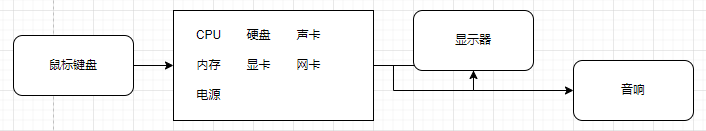
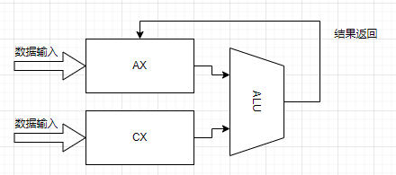
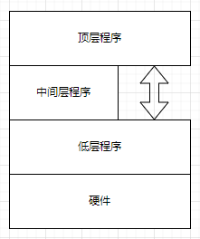
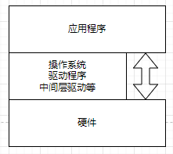
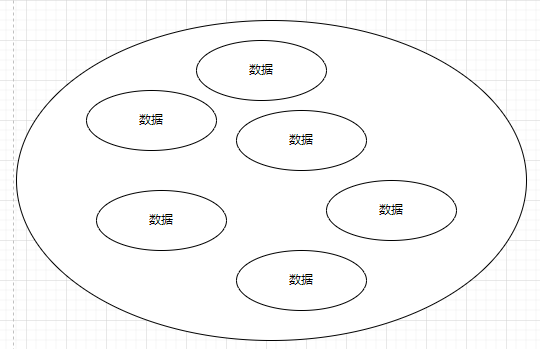
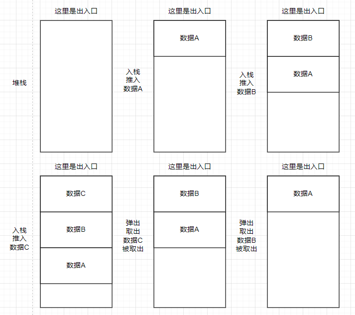
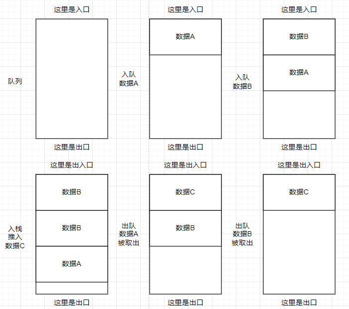
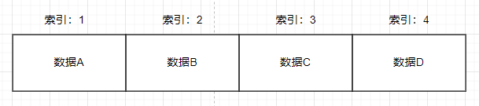
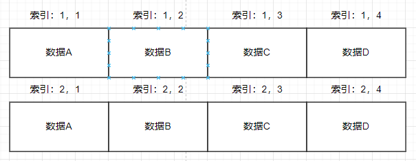
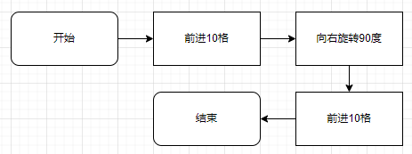

# 编程入门

目录
- [计算机](#计算机)
  - [计算机硬件](#计算机硬件)
  - [计算机结构](#计算机结构)
  - [计算机软件](#计算机软件)
- [二进制](#二进制)
  - [进制间的转换](#进制间的转换)
  - [数据单元](#数据单元)
  - [数据类型](#数据类型)
  - [大端序与小端序](#大端序与小端序)
  - [字符编码](#字符编码)
  - [二进制运算](#二进制运算)
  - [数据结构](#数据结构)
- [程序](#程序)
  - [编程语言](#编程语言)
  - [程序的执行](#程序的执行)
  - [程序流程](#程序流程)
  - [函数](#函数)
  - [算法](#算法)

## 计算机

在开始学习编程之前，需要先知道什么叫计算机  
在百度百科的词条[计算机](https://baike.baidu.com/item/%E8%AE%A1%E7%AE%97%E6%9C%BA/140338)有定义  
```
计算机（computer）俗称电脑，是现代一种用于高速计算的电子计算机器，可以进行数值计算，又可以进行逻辑计算，还具有存储记忆功能。是能够按照程序运行，自动、高速处理海量数据的现代化智能电子设备。
```
~~然后后面还有一大串说明~~

简单来说，它是一个黑盒子，可以输入指令和数据，然后进行处理，输出并展现结果  


输入的类型可以有很多种，但必须包含指令，可以不用包含数据  
数据处理可以有多种方式，例如数学运算处理，将你输入的数据进行加减乘除  
输出的方式也有很多种，甚至可以同时以多种方式进行输出，某些情况可能会没有输出  

当然，计算机的结构也没有这么简单，主要来说包含两个部分
- 计算机硬件(hardware)
- 计算机软件(software)

### 计算机硬件

硬件简单理解就是你的买的电脑，无论是台式机还是笔记本，它只要能正常运行，都是计算机硬件  
`硬件部分`一般包含几个重要部分
- `中央处理器(CPU)` 例如i7-13700K，R9-9950x
- `随机存储器(RAM)` 例如DDR5内存
- `数据存储器(ROM)` 例如机械硬盘(HDD)，或者固态硬盘(SSD)，~~黑心笔记本用的固态颗粒(FLASH)~~
- `电源(Power)` 每台电脑都必须要有个电源才能工作

还有各类`输入/输出`设备
- `鼠标键盘` 现代计算机的输入都必备
- `显示器` 现代计算机输出标配
- `声音输出设备` 常见电脑都会有耳机孔
- `USB控制器` 可以让你接入设备

为了更好的体验还会同时装上
- `网卡` 可以让你上网冲浪
- `显卡` 可以让你在电脑上打游戏
- ~~`RGB控制器` More RGB!!!~~



主流计算机都会将各类输入输出设备或者其他设备等集中安装在一块电路板上，一般都把它叫`电脑主板`  
`主板`上可以更换CPU，PCIE设备(你的显卡插在上面)，接硬盘等  

虽然计算机硬件种类非常多，五花八门，但都不会缺少三样东西
- 计算单元
- 存储单元
- 输入输出接口

只要有这三样东西基本都可以算作计算机

### 计算机结构

现代计算机所遵循的基本结构为`冯·诺依曼结构`  
  

在这个结构里面，一般包含`输入设备`，`存储器`，`输出设备`，`运算器`和`控制器`  
`运算器`和`控制器`一般合在一起叫`CPU`  
存储器一般有`RAM`，`ROM`两种，同时存储器有个`物理地址`，所有存储器的`读写操作`必须通过`地址`来进行，`地址`相当于存储器的标号，就跟家里的门牌号作用类型，需要先找到对应的存储器，才能进行`读写操作`  
`CPU`的里面通常会有个自己的`小RAM`，叫做`寄存器`，通过往`寄存器`里面写`指令数据`，就可以控制`CPU`进行操作，`寄存器`也有地址，一般是固定的特殊地址  

`冯·诺依曼结构`一般流程为
- 输入的指令与数据会存在存储器里面
- 控制器会读取存储器里面的指令
- 根据指令让运算器取数据进行计算
- 然后运算器把结果返回存储器
- 输出设备将数据从存储器取出输出结果

  

至于数据是怎么存入存储器里面的，CPU为什么可以通过写寄存器来控制，可以去看，清华大学出版的[《计算机组成原理（第4版）》](https://baike.baidu.com/item/%E8%AE%A1%E7%AE%97%E6%9C%BA%E7%BB%84%E6%88%90%E5%8E%9F%E7%90%86%EF%BC%88%E7%AC%AC4%E7%89%88%EF%BC%89/55541138)  
剩下的知识感兴趣的可以去了解[冯·诺依曼结构](https://baike.baidu.com/item/%E5%86%AF%C2%B7%E8%AF%BA%E4%BE%9D%E6%9B%BC%E7%BB%93%E6%9E%84/9536784)  

剩余的计算机的其他硬件架构，历史等，这里不多细讲，因为这是属于计算机硬件的知识，本教程着重计算机软件相关的知识  

### 计算机软件

计算机软件就与计算机编程息息相关  

其实实际上，计算机并没有那么聪明，其硬件在接入电源后，若没有运行软件，则基本上什么都做不了  
计算机硬件很大程度上只是能决定计算机的性能，或者输入输出数据的类型方式等，并不能真正实现复杂运算  
当然计算机硬件本身是可以进行简单数据处理的，但也只能进行简单的计算，没有计算机软件，则不能算是真正的动起来  
计算机程序会将复杂的操作，转变为计算机能够执行的简单操作，从而达到处理复杂数据  
因此想要计算机去处理数据，就需要编写计算机软件，而编写过程就叫做`编程`  

计算机软件层次一般分为三个层次
- 底层程序
- 中间层程序
- 顶层程序

  

`底层程序`一般与硬件操作相关，例如将数据送给`存储器`，让`CPU`进行数据处理  
它们主要是操作计算机硬件的`寄存器`等硬件部分，主要是让硬件真正动起来  
例如让声卡发声，则需要底层程序操作声卡的`存储器`，往它的`寄存器`写入播放指令、音频格式通道等，然后再往它的`内存(缓冲区)`写入音频数据，这样声卡才能够发声  

`中间层程序`一般是`底层程序`的包装，也有可能是某些常用功能的包装，它们都是为顶层程序提供一个更广泛，更实用的接口，  
例如我们常见的文件操作系统`FAT32`、`EXT4`、`NTFS`等，都属于中间层，它给底层`存储器操作程序`进行了包装，提供了一个文件系统的广泛使用接口，只需要通过读写文件的方式，就能够往`存储器`里面读写数据，同时文件系统有文件管理器，则不需要我们再手动进行`存储器管理(磁盘管理)`操作，方便了顶层程序开发  
又例如一些数学库，它提供了幂指数(pow)，开方(sqrt)，取绝对值(abs)等

`顶层程序`一般是应用程序，用户通过调用`中间层`或者`底层`程序的接口，可以快速的开发自己想要的软件  
例如大部分计算机软件都是`顶层程序`，他们或多或少都调用了上一层的程序，然后加上自己的逻辑代码，实现了某种高级功能

在计算机软件中，除了三层程序，又将软件分为了
- 操作系统
- 内核驱动\驱动程序
- 应用程序
这样做能够更充分的发挥计算机的作用，提升开发效率  

  

`操作系统`，大部分电脑都会安装`Windows`操作系统，或者`Macos`操作系统，服务器上通常使用`Linux`操作系统等，这些操作系统一般是`底层程序`与`中间层程序`的集合，同时包含少量`顶层程序`，打包在一起，安装在计算机中  
`操作系统`一般实现了硬件的控制，为应用程序提供了接口，提供了大量的控制器、管理器，例如调度控制器，文件管理器，设备管理器，存储管理器，窗口管理器等  

`内核驱动`是`操作系统`中底层与中间层部分的表达，它的主要功能就是来操作计算机硬件的专门软件，它有可能包含`底层软件`和`中间层软件`，但很少会包含`顶层软件`  
例如你安装的显卡驱动里面，就会包含操作系统的内核驱动

`应用程序`就是我们常说的应用软件APP，它就是我们所谓编写的软件，它也是计算机软件最多的部分，一般运行在操作系统上，借助`内核驱动`来调用底层硬件资源    
常见的音乐播放器，时钟等都是应用程序，这些软件运行时，或多或少都调用了`操作系统`的接口  
当应用程序若运行在操作系统上，可以不需要专门去管理硬件，因为这些管理已经由`操作系统`或者`驱动`去处理了  

大部分`操作系统`不允许你跨过系统驱动直接操作`硬件寄存器`，所有硬件操作都必须在操作系统的驱动里面进行，这是为了硬件安全所考虑，以防止有恶意软件破坏你的电脑，但是有些操作系统又允许你这样做，在应用层就需要编写对应的驱动程序就能操作更灵活的使用芯片的`外设`，往往在嵌入式应用比较常见  

有一些应用程序不运行在操作系统上，这些应用程序包含了所有的硬件驱动，中间层等，一般这类叫做[裸机](https://baike.baidu.com/item/%E8%A3%B8%E6%9C%BA)，常见在[微型计算机](https://baike.baidu.com/item/%E5%BE%AE%E5%9E%8B%E8%AE%A1%E7%AE%97%E6%9C%BA/9287)中  
`微型计算机`有时还会运行一种叫做[实时操作系统](https://baike.baidu.com/item/%E5%AE%9E%E6%97%B6%E6%93%8D%E4%BD%9C%E7%B3%BB%E7%BB%9F/357530)的软件，它的实时性能比常见的`操作系统`要高，但是打包包含的功能较少  

## 二进制

知道了程序，下面应该知道计算机是如何存储数据的  
例如数字`123`
文字
```
this is text
这是一个文本
```
是怎么在计算机中存储的

在这之前，需要先认识二进制  
说到二进制肯定很陌生，但是可以从`逢10进1`可以知道，我们常见的数学计算是
```
9+1=10
99+1=100
```
可以看到，是简单的进位了，而且是加到10就进位，这就叫做`十进制`，同理，`二进制`也是这样的概念  
```
1+1=10
11+1=110
```
可以看到是`逢2进1`

由于计算机的电路，只能储存`0(低电平)`或者`1(高电平)`，因此所有数据都需要转换为`二进制`进行存储  
由于`十进制`在计算机运算比较麻烦，因此延伸出了`二进制(BIN)`，`八进制(OCT)`，`十六进制(HEX)`，其中`二进制`与`十六进制`是最常用的进制  
一个十进制数`666`在其他进制表示为
```
0b001010011010  二进制
01232           八进制
666             十进制
0x29A           十六进制
```

### 进制间的转换

`二进制` 与 `十六进制` 可以通过记下面这张表
```
0000 0 0001 1 0010 2 0011 3
0100 4 0101 5 0110 6 0111 7
1000 8 1001 9 1010 A 1011 B
1100 C 1101 D 1110 E 1111 F
```

`二进制` 与 `八进制` 可以通过记下面这张表
```
000 0 001 1 010 2 011 3
100 4 101 5 110 6 111 7
```

`八进制` 与 `十六进制` 可以先转换为`二进制`，再通过查表

`十进制` 与其他进制，只能通过计算得到  
例如
```
0xF5
= 16*15+5
= 245
0x456
= 16*16*4+16*5+6
= 1110
```

### 数据单元

在计算机中，通常把`8个二进制`划成一个单元，成为一个`字节(byte)`  
而`1位二进制`称为`比特(bit)`

然后计算机的储存就以`字节`作为`最小储存单元`，以方便后面的计算，所有的操作都是以这个最小单元作为基准，~~为什么不用bit或者为什么以8bit作为单元可以不用管，大家都这样用还挺方便的~~  
一个存储单元能存储的范围为`0-255`对应16进制`0x00-0xFF`  

在计算机中，`内存(RAM)`或者`储存(ROM)`都以`字节`为最小单位，芯片的`寄存器`里面也是以`字节`为最小单位  
这些单元都会分配一个地址，它看起来像是`0x80001222`或者`0x00000000`，一般称之为`内存地址`

### 数据类型

由于一个单元能存储的数据量太小了，同时也不满足后续发展，因此又增加了其他几种类型，使用更多的存储单元来装数据  
同时还给这些类型统一为了一个规范的数据类型，在各类计算机，程序里面通用  

基础数据类型有
- 无符号整数
- 有符号整数
- 浮点
衍生的类型
- 布尔
- 字符

若整数有正负之分，则称为`有符号类型`，若没有正负则称为`无符号类型`  
`浮点类型`用于处理小数，同时对小数的精度提出了`单精度`与`双精度`
在64位软件中常见的数据类型有  
~~至于什么是64位你可以不用管，目前绝大多数新软件都是64位~~
| 名称 | 位数 | 字节数 | 数据范围 |
| Byte(字节型) | 8bit | 1byte | 0 ~ 255(u8) 或 -128 ~ 127(i8) |
| Short(短整数型) | 16bit | 2byte | 0 ~ 65,535(u16) 或 -32,768 ~ 32,767(i16) |
| Integer(整数型) | 32bit | 4byte | 0 ~ 4,294,967,295(u32) 或 -2,147,483,648 ~ 2,147,483,647(i32) |
| Long(长整形) | 64bit | 8byte | 0 ~ 18,446,744,073,709,551,615(u64) 或 -9,223,372,036,854,775,808 ~ 9,223,372,036,854,775,807(i64) |
| Float(单精度浮点型) | 32bit | 4byte | 3.4E +/- 38 |
| Double(双精度浮点型) | 64bit | 8byte | 1.7E +/- 308 |
衍生类型
| 名称 | 位数 | 字节数 | 数据范围 |
| Boolean(布尔型) | 看语言 | 看语言 | true(1) 或 false(0) |
| Char(字符) | 看语言 | 看语言 | 看长度然后根据上面的整数类型取值范围一样 |
**后面的数据类型统一使用英文来表达**

若将字符逐一连接在一起，会变成`字符串(String)`，其存储结构在数据结构中有所体现

### 大端序与小端序

在计算机中，一个占用多个字节的数据有两种方式储存  
主要分为
- Big-endian大端序：高位字节在前，低位字节在后
- Little-endian小端序：低位字节在前，高位字节在后

例如，数字0x12345678
若以大端序储存，则在内存中看起来为
```
12 34 56 78
```
若以小端序储存，则在内存中看起来为
```
78 56 34 12
```
也即是以字节为单位，左右颠倒的区别，在使用`字节操作`时，需要注意这个数据是`大端序`还是`小端序`，错误的处理会导致不正确的结果  
只有处理超过1个字节长的数据时才用考虑，若数据长度只有1字节，`大端序`与`小端序`都是一样的  
计算机常用`小端序`但也不排除某些地方会用到`大端序`

### 字符编码

字符类型一般看字符编码，字符编码相当于一个字典，一个数字对应一个字符对应  
例如我可以用，下面是HEX
```
00 表示 A
01 表示 B
02 表示 C
```
等等，将所有常用字符一一对应变成一个表格，这个表格就叫做字符编码  

常见的字符编码有`ASCII`、`GBK`、`Unicode`、`UTF-8`、`UTF-16`  
`ASCII`是`美国标准信息交换代码`大部分计算机都是以`ASCII`作为基础其范围为(0x00-0x7F)  
其中(0x20-0x7E)里面是可显示字符，(0x00-0x1F和0x7F)是控制字符，无法显示  
详情可以查看[ASCII表格](https://www.runoob.com/w3cnote/ascii.html)

`GBK`是`《汉字内码扩展规范》`，是由`中华人民共和国全国信息技术标准化技术委员会`1995年12月1日制订，目前已被其他字符集取代，但是仍有很多地方在使用这个编码  
[GBK编码表](https://www.toolhelper.cn/Encoding/GBK)

`Unicode`是`统一码`，由`统一码联盟`开发，包括字符集、编码方案等  
`UTF-8`是针对`Unicode`的一种可变长度字符编码
`UTF-16`是`Unicode`字符的一种实现方式，长度有1字节与2字节，但为了方便一般都是2字节  
大部分编程语言，字符集都采用`UTF-16`，也就是字符长度一般都是2字节  
`UTF-16`有`小端序`与`大端序`两种，称为`UTF-16LE`或者`UTF-16BE`，一般会在开头加入`FF FE`或者`FE FF`表示是`UTF-16LE`还是`UTF-16BE`

### 二进制运算

在计算机中，处理数据都使用二进制运算  
运算方式分为
- 算术运算：加、减、乘、除
- 逻辑运算：或、与、非、异或

加法运算：
```
0 + 0 = 0
0 + 1 = 1
1 + 0 = 1
1 + 1 = 10 (进位，硬件寄存器修改)
```
减法运算：
```
0 - 0 = 0
0 - 1 = 1  (借位，硬件寄存器修改)
1 - 0 = 1
1 - 1 - 0
```
乘法运算：
```
0 * 0 = 0
0 * 1 = 0
1 * 0 = 0
1 * 1 = 1
```
除法运算：
```
1 / 1 = 1
0 / 1 = 0
1 / 0 报错 产生硬件错误，寄存器修改，同时中断程序运行
0 / 0 报错 产生硬件错误，寄存器修改，同时中断程序运行
```
除法报错可以看看[x86的指令集](https://www.felixcloutier.com/x86/div)里面的说明  
进位、借位等操作，是在硬件上的寄存器某个位发生改变实现的，这里不讲硬件部分，所以跳过  
除法是硬件中实现最困难的部分，需要消耗很多算力才能实现，所以基本上会通过其他方式实现触发，或者直接消耗更多硬件资源实现  

逻辑或运算：
```
0 | 0 = 0
0 | 1 = 1
1 | 0 = 1
1 | 1 = 1
```
逻辑与运算：
```
0 & 0 = 0
0 & 1 = 0
1 & 0 = 0
1 & 1 = 1
```
逻辑非运算
```
!1 = 0
!0 = 1
```
逻辑异或运算
```
0 ^ 0 = 0
0 ^ 1 = 1
1 ^ 0 = 1
1 ^ 1 = 0
```

这里只列举了一位的运算，实际上，会以8位 16位 32位 64位 等的方式运算  
二进制结果进入，会产生二进制结果输出  

### 数据结构

计算机存储数据时，不会只用几个单元就能完好的储存，同时还需要存储一些数据相关的关系  
由此就需要了解`数据结构`  

我们把一些数据`圈`起来，可以称之为`数据集合`



但是这些数据之间没有关系，需要一些说明来让这个集合里面的数据有联系，这时候就需要`数据结构`了

常见的`数据结构`有
- 堆栈(Stack)
- 队列(Queue)
- 数组(Array)
- 链表(Linked List)
- 树(Tree)
- 图(Graph)
- 堆(Heep)
- 散列表(Hash Table)

在计算机学习中，`数据结构`是一门独立的课程，相对比较复杂，这里只提取其中几个说明  

`堆栈(Stack)`又称`栈`，是一种`后进先出(LIFO)`集合  
数据从这个集合中`输入`与`取出`只有一个口  
里面的数据有先后顺序之分，越后来的，越靠近出入口  
`堆栈`使用两种基本操作：`推入（压栈，push）`和`弹出（弹栈，pop）`：
- 推入：将数据从出入口放入，并且会在堆栈顶端
- 弹出：将数据从出入口取出，只能取最靠近入口的数据
  
如果你放入了`A->B->C`，需要取出`A`，则需要先将`C`和`B`都取出

`队列(Queue)`，是一种`后进先出(FIFO)`集合  
数据从入口输入，从出口输出  
里面的数据有先后顺序之分，越先来的，越靠近出口  
`队列`也只有两种基本操作，`入队`和`出队`与堆栈相似  
  
如果你放入了`A->B->C`，需要取出`C`，则需要先将`A`和`B`都取出

`数组(Array)`将相同类型的数据，以有序的方式储存，并利用`索引(Index)`来获取里面存储的数据的数据结构  
  
数组有`一维数组`，`二维数组`，`三维数组`等等，对应线性代数中的矩阵  
  
数组是编程中最常用的用于存储大量相同类型数据的手段，例如存储`字符串`时，就会使用`一维数组`  

有兴趣了解完整的可以去看[数据结构](https://zh.wikipedia.org/wiki/%E6%95%B0%E6%8D%AE%E7%BB%93%E6%9E%84)

## 程序

`程序`一般指的是`计算机程序`，但一般人理解的是运行在操作系统的软件  
而程序的制作与编写则叫做`编程`  
若需要计算机处理某些数据，或做某些事情，则需要编写专门的程序  

### 编程语言

要编写一个计算机看得懂，能够跑的程序，则需要通过编程  
而在开始编程时，则需要选择一门编程语言  
常见的`C语言`，`C++语言`，`C#语言`，`JAVA语言`，`Python语言`都叫编程语言

编程语言有严格的语法规定，根据编程语言的规范会有不同的语法  

编程语言可以根据其`执行方式`分为
- 编译型语言
- 解释型语言
编译型语言在执行前，需要通过`编译器`，将程序转换为计算机能够直接执行的程序，也就是计算机能够直接读得懂的指令与数据，这个过程一般叫做`编译`  
例如`C语言`，`C++`，`Rust`等，在运行前都要编译才能够运行  
解释型语言不需要通过`编译器`的`编译`也能够执行，它通过一个`解释器`来进行解释，间接的转变为计算机能够懂的指令与数据  
例如`Python`，`JavaScript`等  
运行效率上，`编译型语言`往往有着比`解释型语言`更高的效率

然后根据他们的`类型处理`可以将语言分为两种
- 强类型语言
- 弱类型语言
强类型指的是，我在`编译`或者`执行`时，`数据类型`有严格规定，数字就是数字，文字就是文字，相互之间不能混用，一旦混用则会`丢出异常`  
弱类型指的是与强类型相反的操作，`数据类型`没有严格规定，在`编译`或者`执行`时可以随便转换，若不恰当处理这些数据类型，有可能会出现问题，例如`JavaScript`中
```
0.1+0.2=0.30000000000000004
```
~~不等于0.3很奇怪吧，[详情](https://blog.csdn.net/qq_34595425/article/details/119610620)~~

编程语言还可以根据`软件开发方法`分为
- 面向过程
- 面向对象
面向过程通常来讲就是按照逻辑流程来编写程序  
面向对象就是把你的逻辑全部先包装包，然后再按照流程来写  
面向过程最多的只有C语言还在用，绝大多数其他的主流语言都是面向对象  
面向对象可以在你学习某种语言的时候再进行学习，这里可以看[这里的说明](https://baike.baidu.com/item/%E9%9D%A2%E5%90%91%E5%AF%B9%E8%B1%A1/2262089)。  
面向对象会在编程时不自主的就会去使用了，不能完全理解也不是非常重要  

### 程序的执行

程序或者说代码的执行，一般执行方式有两种
- 本机执行
- 虚拟机执行

在代码编译的时候，有两种编译结果，一种是编译成`本机二进制`，另一种是编译成`中间二进制`

`本机二进制`指的是，编译器根据你的CPU特性，编译出一份独特的结果，这个编译结果可以`直接在你的电脑上运行`，且这个结果只能在与之相关的平台上运行  
例如你的电脑CPU是Intel的`x86_64`处理器，你的操作系统为`Windows`，你的编译程序将你的代码通过本机编译后会生成一个`win-x64`的程序，这个程序也叫做`本机二进制程序`，此时`Windows`叫做目标操作系统，`x86_64`叫做目标指令集  
它只能在你的电脑上，或者其他使用了`Windows`且支持`x86_64`的CPU上运行，只要是运行在`Windows`之外的处理器，或者是不支持`x86_64`指令集的CPU，都无法运行你编译出来的程序  
你在电脑上编译出来的`win-x64`软件无法在`安卓手机`上运行，这是因为安卓手机的操作系统为`Linux`内核，且你的手机处理器为`arm64`，不支持运行`win-x64`的程序  

`中间二进制`指的是，编译器不会根据你的CPU特性，编译出独占的二进制，而是一个`中间二进制`  
这个中间二进制`不能直接在你的电脑上运行`，而是需要一个特殊的`解释器`，将`中间二进制`解释或者翻译成`本机二进制`，只有这样你的电脑才能执行这个程序  

`本机执行`就是说直接执行这个`本机二进制`  
`虚拟机执行`就是说执行这个`中间二进制`，需要通过将`中间二进制`变成`本机二进制`再执行  
而这个转换工具就是[实时编译(JIT)](https://baike.baidu.com/item/%E5%AE%9E%E6%97%B6%E7%BC%96%E8%AF%91/23120992)

因此通常来说`本机二进制`的体积较小，且不需要`实时编译(JIT)`就能直接运行，并且运行效率很高  
而`中间二进制`加上这个`实时编译(JIT)`会导致软件体积变大，且运行效率没有本机二进制高  
但由于`中间二进制`有编译一次，到处运行的特性，时常会被很多软件采用该方案，很多`跨平台`程序也可以通过这种手段简化开发流程

例如`C#`与`Java`就是采用了`JIT`方式工作，可以让开发人员大幅度简化了多平台适配问题  

但由于`JIT`有着启动时间长的问题，又出现了[Native AOT](https://learn.microsoft.com/zh-cn/dotnet/core/deploying/native-aot/)方案，这是一个将`中间二进制`在编译时直接生成`本机二进制`的方案，极大优化了启动速度。~~绕来绕去又回到本机二进制~~

### 程序流程

一个程序，使用编程语言进行编写，需要一个很强的逻辑流程  
你需要从一个确定目标，一个非常复杂的执行，逐步拆分，直到分割成计算机能够理解的最简单操作  

例如下面的例子，有一辆小车，它放在一个10x10的网格内，车辆前进方向是上方  

  

这辆小车可以认得清下面几种指令
- 前进x格
- 后退x格
- 向左旋转x度
- 向右旋转x度

现在你需要编写一个程序，让小车从红色方框运行到蓝色方框  
这时候，你就需要拆分这个运动逻辑了  
你可以很快就想到下面逻辑
```
- 前进10格
- 向右旋转90度
- 前进10格
```
然后将这个逻辑转变为一个带箭头的图  

  

这种带箭头的图一般称为`程序流程图`，它粗略的说明了你的整个程序逻辑思路是怎么样的，步骤与步骤的关系是如何的  
在刚开始学习编程的时候，流程图能够更好的理解程序的运行过程，然后就能思考出代码应该怎么写  
在编写了很多代码后，`程序流程图`就会在你的脑海中自动生成了，同时也能生成出对应的代码

### 函数

现在我将需求修改，需要让小车从红色方框运行到蓝色方框，再从蓝色方框运行回红色方框  
同理上面的简单逻辑，可以得到  
```
- 前进10格
- 向右旋转90度
- 前进10格
- 向右旋转90度
- 前进10格
- 向右旋转90度
- 前进10格
```

你会发现，其实有些步骤重复了，可以将这些重复步骤包装起来，作为一个可以重复利用的东西  
`函数`就诞生了  
**这里的`函数`指的是`计算机函数`**

我将
```
- 前进10格
- 向右旋转90度
```
这两个步骤包装为一个函数，名字为`前进并旋转`  
此时，这个函数就变成了一个步骤，变向的称为了一个计算机能够识别的指令  
此时原来的逻辑可以变成
```
- 前进并旋转
- 前进并旋转
- 前进并旋转
- 前进并旋转
```

这里是一个简单的函数举例说明，正常的函数还会同时伴有`传入参数`和`传出结果`  
`传入参数`代表的就是往函数里面传入你需要的处理的数据  
例如`前进x格`中的`x`，就是一个`函数参数`，在使用这条指令时，传入的数值会被识别为移动的距离，调整这个值就会调整距离，所以这是一个`传入参数`的作用  

其实编程过程中，我们都会使用大量的函数，或者编写大量的函数来满足需求  
如果不编写参数，将操作包装起来，那么这个代码量将会非常庞大，涉及到硬件相关的操作也会非常复杂  
因此将重复的逻辑包装起来，是编写程序中非常重要的步骤  

### 循环

在程序中，还有一个比较重要的逻辑，叫做循环  
在上面的逻辑中，你发现`前进并旋转`重复执行了4次，若我需要改成重复执行8次，那么往下加语句就可以了  
但是我需要重复执行N次，再往下写就比较麻烦了，因此使用循环替代这种操作就能剩下很多功夫  

```
- 循环执行 4次 前进并旋转
```

你会发现这个与函数好像没有什么区别，但是根据不同的编程语言，循环的实现也不一样，这个需要看具体情况而定，大部分语言的循环是个特殊语法，不是函数，当然也有一些可以实现循环的函数  

### 算法

在让小车从红色区域运行到蓝色区域，我们所编写的这段逻辑，可以称之为非常简单的算法，当然也算不上真正意义上的算法  

在百度百科中，算法的定义为
```
算法（Algorithm）是指解题方案的准确而完整的描述，是一系列解决问题的清晰指令，算法代表着用系统的方法描述解决问题的策略机制
```

算法的特性：
- 有穷性 需要在有限的步骤内完成这件事情
- 确切行 算法中的每一个步骤都有定义
- 输入 算法可以输入多个或者不输入初始数据
- 输出 算法执行后，必须要有一个或者多个输出，表示这个算法有意义

算法这是一个解决问题的完整思路，其过程必须使用函数或者基础语句  
算法本身需要完成某样事情，并且有`开头`与`结尾`，同时需要在`有限的步骤`内完成这件事情  

算法有几个指标评定其好坏程度：
- 时间复杂度 一般用O(n)表示，对于算法来说，使用的时间越短越好
- 空间复杂度 也用O(n)表示，对于算法来说，使用的空间越少越好
- 正确性/确切性 对于相同的数据，不同的算法会有这不同的输出，算法输出正不正确，也是一个评定指标
还有一些地方可能会考虑
- 可读性 这个算法是否能让人更好的阅读与理解
- 鲁棒性 当我不能确定输入数据是否合理时，这个算法能否处理这些不合理的数据

一个优秀的算法，往往给人的感觉就是速度变快，使用空间变少  
同时也肯定需要大量的时间去思考，验证，包装等  

我们计算机内已经有很多优秀的算法来处理很多事情了，但这些算法可能还会继续有优化的空间  
所以当你编写一个程序后，也应该着手考虑算法的优化，提升运行效率  

对于上面的小车程序，从红色方框运行到蓝色方框，可以将其优化为下面这个思路
```
- 向右旋转45度
- 前进√100格
```
你会发现得到的结果都是一样的，同时速度更快，这就是不同逻辑思考下产生的结果  
一般写代码的时候，只会想出普通的逻辑，但是一些资深的程序员，有可能会想到下面那种简单的逻辑  
因此提升代码效率的方式就是优化逻辑，节省步骤达到节省时间或者空间  

更多关于算法的知识，可以查看[算法是什么？](https://c.biancheng.net/view/b0tyrpb.html)