# 编程软件

这里列举了常用的编程软件

## VSCode

[VSCode](https://code.visualstudio.com/)这是一个微软开发的`开源`编程相关软件，分发协议为`MIT`  

下面是官网的介绍图片  

本质上是个`文本编辑器`，但是装上许多`插件`后，就能变成各种`开发平台`，集成各类`开发工具`，组成一个小型IDE  
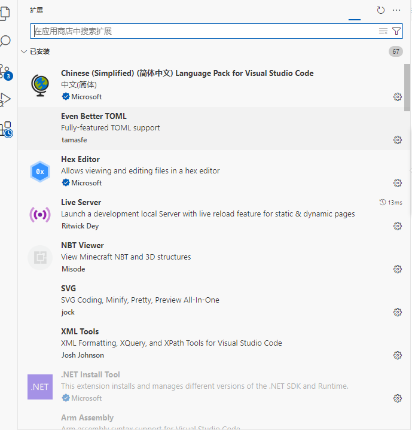

支持`Windows`、`Linux`、`Macos`操作系统，安装后就能直接运行  
有汉化，可以全中文使用，但是`插件`要看作者做不做中文支持

例如我要做C语言开发，装个`Gcc`、`CMake`再加上VSCode的`C++开发套件`，就能做C语言开发了  
其他语言也是，只要有插件支持，就能做对应语言的编程开发，但是不是所有语言都能很好的支持，要看插件作者的制作程度  
微软官方也做有主流语言的支持插件，只要安装好，配置好了基本上都可以正常使用  
VSCode大部分功能都有靠插件实现，同时配置也需要自己弄好，因此对比主流`IDE`上手成本比较大

## Git

[Git](https://git-scm.com/about/branching-and-merging)是一个开源的版本控制软件，前身是`Linus Torvalds`为了帮助管理Linux内核开发而开发的一个开放源码的版本控制软件

它有`仓库(repository)`、`分支(branche)`，`版本(commit)`，`标签(tag)`等概念，同时有`合并(pull)`，`同步(sync)`等操作，当你使用的时候需要去了解  
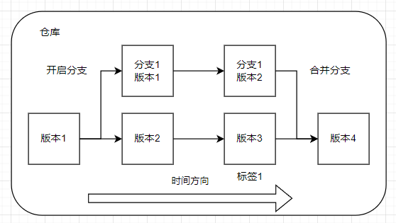

在使用git管理代码时，需要先创建`一个仓库`和`一个主分支`，才能往里面存代码  
代码是存在分支里面的，每个仓库都必须要有一个分支，这个分支相当于小仓库，用于存储代码  
在编写完代码或者修改代码后，需要创建一个版本和写一个注释`comment`向分支提交本次修改，这样你的修改才能够保存下来  
你可以给某个版本提取出来，作为一个新的`分支`，叫做`创建分支`，这个分支就相当于新的小仓库，功能与主分支一样，但是它是从`被克隆分支`上的某个版本复制过来的，也就是前面的修改都会复制过来，而后面的修改就可能不一样了  
例如我在主分支`创建A文件`，并提交了一个版本，然后以这个版本开一个新的分支，在这个新分支中`创建B文件`，那么这个新分支里面就会有个`A文件`与`B文件`，主分支里面只有`文件A`没有`文件B`  
开分支做区分是做一些测试用途，或者破坏性试验的隔离，当然用法还有很多  
这两个分支在某个节点分叉后，可以独立修改互不影响，若你想让这两个分支的修改合并，那么就用到`分支合并`操作  

git的仓库不止可以在你的电脑上，还可以在其他服务器上托管，就是将你的代码上传到其他地方保存，主流的git托管平台有`Github`，`gitee`  
一般来说`github`如果你可以进首选使用这个，不行则使用`gitee`  
所谓的`开源`其实就是把源码上传到这些托管平台，然后不光你可以访问，其他人也可以阅读或者使用你写的代码，当别人使用你的代码后若想修改会开`分支(fork)`，当修改完后，想发给你让你使用则会`提交合并申请(pull request)`  
不是所有代码都能随便使用，在使用之前需要查看仓库里面的`开源协议(license)`  
主流的开源协议有`MIT`，`Apache`、`BSD`、`GPL`、`LGPL`  

Git的使用很简单，这里有`命令行`跟`Gui界面`两种使用  
**不推荐你一上来就去使用命令行操作，也不推荐你去用Git自带的Gui界面使用**

[Github Desktop](https://github.com/apps/desktop)是一个开源的`Git Gui`软件，集成了`git`与`github平台`相关操作的软件  

第一次使用git可以先使用这个软件作为入门，操作体验会比直接使用git的控制台简单很多，但是不支持中文，需要学习一些相关知识  

[sourcegit](https://github.com/sourcegit-scm/sourcegit)也是一个开源的`Git Gui`软件，这是一个第三方的git客户端，功能跟github desktop差不多，但是支持中文  

下面是使用`sourcegit`简单的教程，这里以`windows11`作为示例  
**sourcegit与git的下载都需要自己准备加速器**

首先是下载并安装`git`，打开[git下载页面](https://git-scm.com/downloads)  
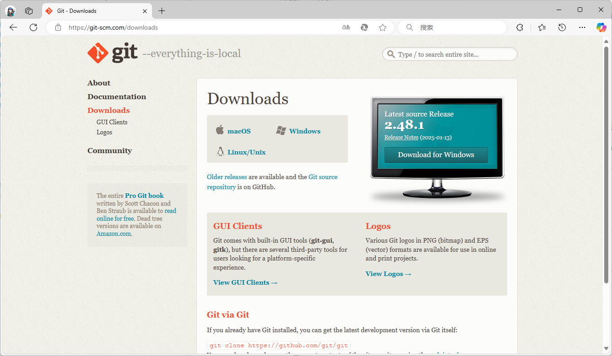  
选择右侧的`Download for Windows`  
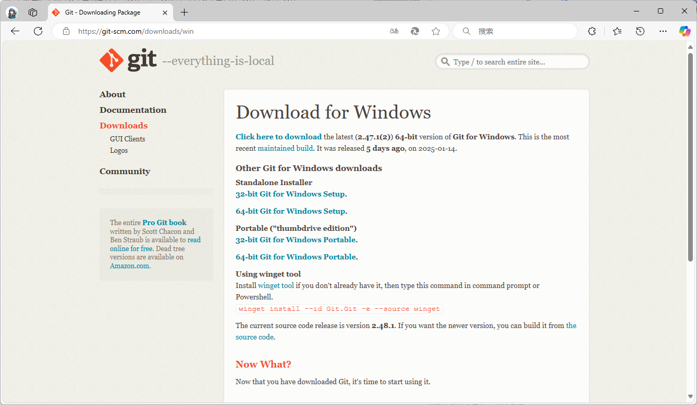  
选择`64-bit Git for Windows Setup.`  
下载完成后打开安装，一路按着`Next`就行，不需要做任何修改   

下载并安装`sourcegit`，打开[sourcegit下载页面](https://github.com/sourcegit-scm/sourcegit/releases)  
往下找到`Assets`选择`win-x64.zip`，之后将这个压缩包解压后，就是软件本体了
**不会解压的可以关闭该教程了，编程不适合你**
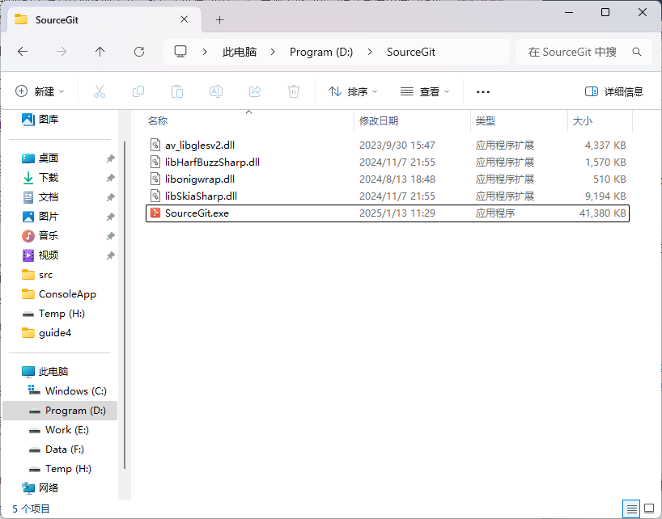  

双击`SourceGit.exe`打开软件  
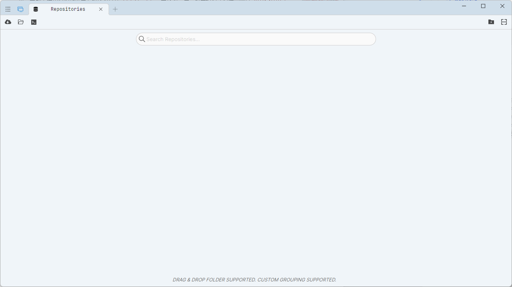  
选择左上角图标进入设置  
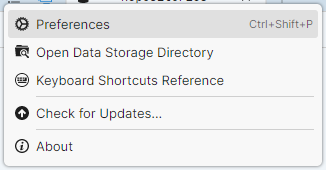  
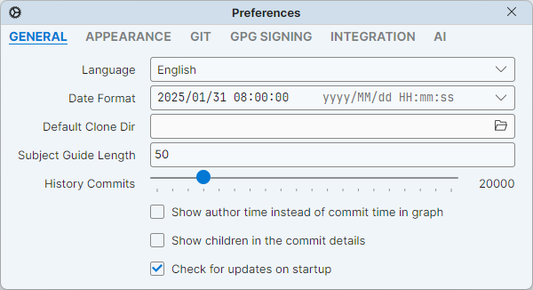  
然后切换为中文  
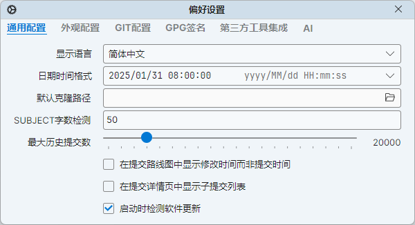  
然后转到`GIT配置`，填写邮箱，用户名  
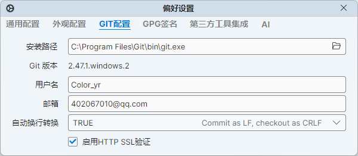  
填写完成后就可以开始使用了

- **创建仓库**  
新建一个文件夹，然后`打开文件夹`  
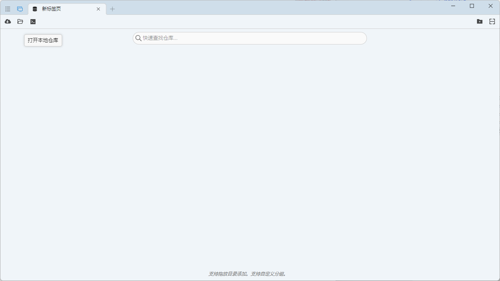  
此时会提示你初始化仓库，选择`确定`  
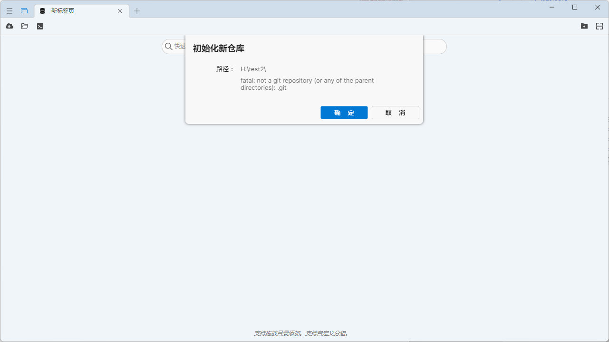  
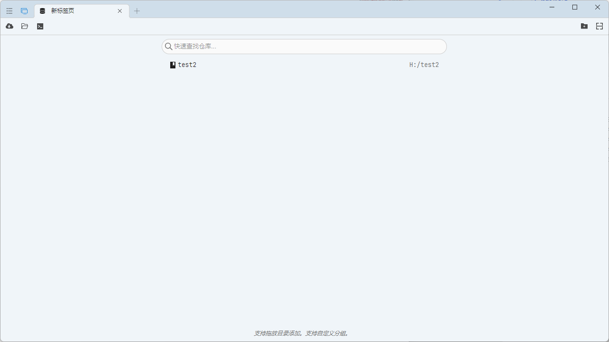  
双击打开仓库  
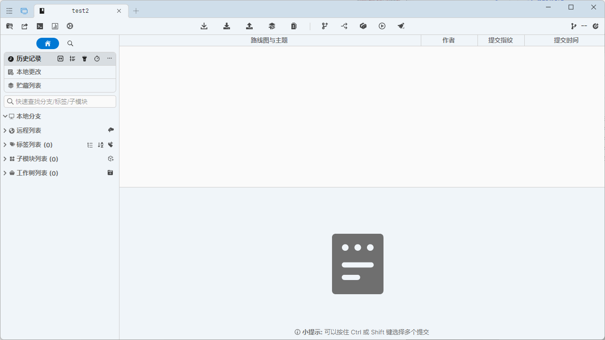  
- **提交修改**  
我在文件夹里面创建了一个文件  
在左侧选择`本地更改`，选中文件，找到`暂存所有`  
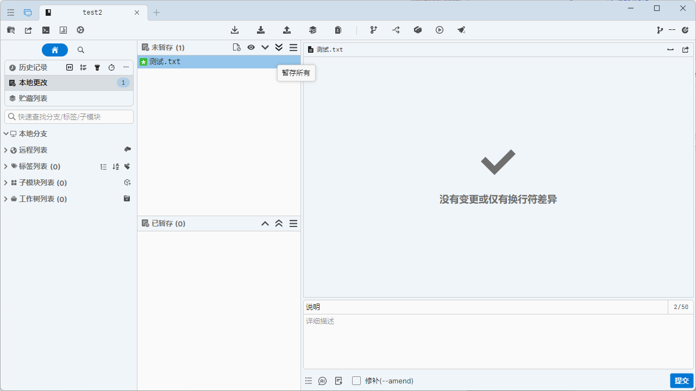  
在右侧填写编辑信息，点击提交  
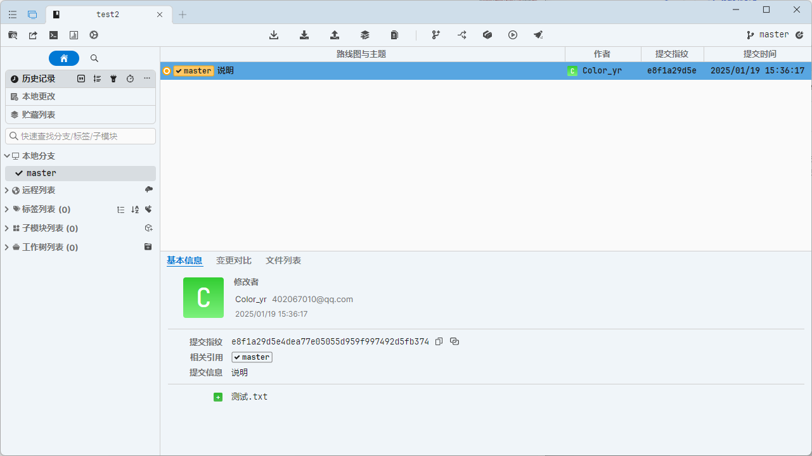  
这样就创建了一个版本
- **新建分支**  
右键主分支，选中新建分支即可
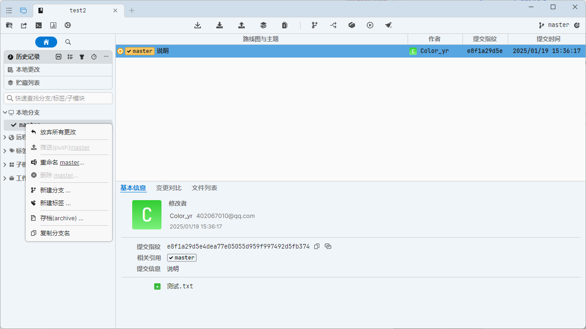  
- **合并分支**  
子分支修改后，右键你需要合并的分支即可  
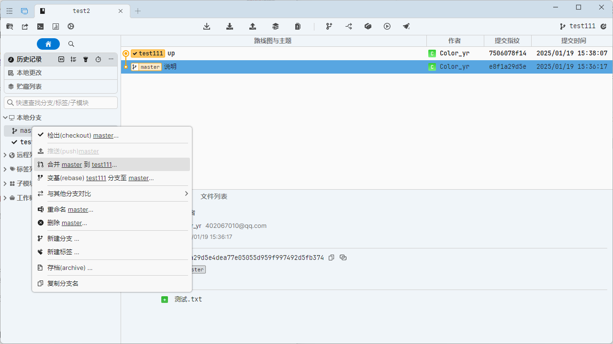  

`git控制台`太长了，可以去看[菜鸟教程](https://www.runoob.com/w3cnote/git-five-minutes-tutorial.html)

`github desktop`也是差不多的  
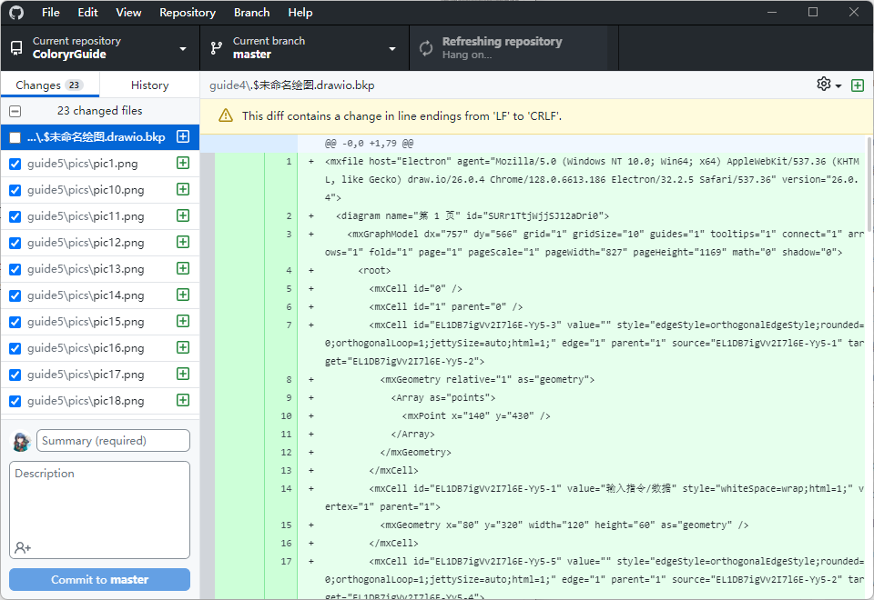  

## IntelliJ IDEA

[IntelliJ IDEA](https://www.jetbrains.com/idea/)是jetbrains推出的JAVA开发IDE，集成了大部分JAVA所需的开发工具  
  
支持Windows、Linux、Macos操作系统，只需要现在安装即可使用，最新版本支持中文  
`IntelliJ IDEA`有`社区版`和`专业版`之分，社区版是免费使用的，专业版需要订阅后才能使用  
如果你是重度Java开发者，则很有可能会用到专业版里面的付费工具，社区版则需要靠插件支持  

`IDEA`支持的语言有`Java`和`Kotlin`，安装插件后可以支持`Rust`等

## Android Studio

[Android Studio](https://developer.android.google.cn/studio?hl=zh-cn)是谷歌根据`IntelliJ IDEA 社区版`改进而来的，专门为安卓开发的IDE  
  
自带界面编辑器，UI制作等一系列安卓开发会用得上的工具  
没有中文汉化，操作跟`IntelliJ IDEA`几乎一样，以前`IntelliJ IDEA`也能做安卓开发，但在新版本之后删除了该功能，需要做安卓开发得使用`Android Studio`  

## Visual Studio 2022

[Visual Studio 2022](https://visualstudio.microsoft.com/zh-hans/vs/)是微软在`Windows`上使用的集成IDE  
支持很多编程语言`C\C++`、`C#`、`VB`、`F#`、`Python`、`JS`、`TS`等  
自带官方汉化，且微软有完整的[使用教程](https://learn.microsoft.com/zh-cn/visualstudio/windows/?view=vs-2022&preserve-view=true)，根据这个教程就能快速入门  
`Visual Studio`有`社区版`、`专业版`、`企业版`3种，一般开发者用`社区版`就足够了，剩下的两个版本在多人协同才有优势  
**Visual Studio只能在Windows上使用，如果你在其他操作系统上使用，则不会得到官方的支持**

## XCode

[XCode](https://developer.apple.com/cn/xcode/)是苹果针对自家平台生态的IDE，只能给苹果相关的设备开发应用程序  

**使用XCode必须拥有一台macos的电脑**
