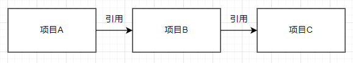

# C#教程

这是一个关于`dotnet8`与`C#`的编程教程  
这里会由浅到深的讲解`C#编程语言`的相关知识  

在开始学习之前，请务必看过[编程相关](../README.md#编程相关)里面的全部内容，否则将会无法理解下面的知识

在开始之前，你需要知道：
- **本教程需要本科及以上学历才能看得懂**  
- **本教程以Windows11和VS2022作为基础环境**
- **本教程以dotnet8作为运行环境及C# 12版本作为编程语言版本**
- **本教程难免会出现错误，可以同[微软官方教程](https://learn.microsoft.com/zh-cn/dotnet/csharp/tour-of-csharp/overview)或其他教程进行交叉学习**

## 目录

- [C#介绍](#C#介绍)
  - [编程环境搭建](#编程环境搭建)
  - [创建示例工程](#创建示例工程)
  - [打包与发布](#打包与发布)
- [认识C#代码](./page1.md#认识C#代码)

# C#介绍

`C#`是微软在`2000年6月发布`的一个使用`.NET框架`，继承了`C/C++`的强大，综合了`JAVA`的灵活性，同时是一门非常热门的编程语言  
`C#`可以用在桌面平台开发(WPF，Winform)，Web应用开发(Asp)，跨平台移动开发(Maui)，游戏开发(Unity)、IoT设备程序开发(某些柜台机会用)，人工智能等领域(AI)  

`C#`是一门编译型强类型语言，编译后生成中间二进制(IL)，需要在Dotnet虚拟机上运行，因此可以实现生成一次在各类操作系统上运行，其运行效率最大可达90%的`C/C++`，某些情况下可能会比`C/C++`还要快  
支持[Native AOT](https://learn.microsoft.com/zh-cn/dotnet/core/deploying/native-aot/)编译，可以生成本机二进制代码加速启动，减少第一次启动时间  

公共语言运行时(CLR)是`.NET`提供了一个称为公共语言运行时的运行时环境，它运行代码并提供使开发过程更轻松的服务，C#编译后会生成CLR可以识别的二进制文件，同时C#也可以访问并调用CLR二进制里面的内容  

`.Net`有`.NET Core`与`.NET Framework`两种，目前常用的是`.NET Framework`，但是新软件开发都选择`.NET Core`，dotnet8指的就是`.NET Core 8`  
`.NET Framework`是windows自带的框架只能在windows上运行，而`.NET Core`可以在大部分主流操作系统上运行  
关于.Net的更多内容，可以在[微软文档](https://learn.microsoft.com/zh-cn/dotnet/core/introduction)里面查看，这里只关注C#  

到2024年，dotnet已经发展到了`dotnet9`，增加了许多特性，但dotnet9有一个[严重的bug](https://github.com/dotnet/runtime/issues/109812)等它修复并发布了再推荐使用  

`C#`支持指针使用，开启不安全代码支持后，可以在C#里面使用指针，从而可以很方便的与`C/C++`库相互调用  
同时还带有很多语法糖，极大的简化了代码长度  
如果你学习过`C/C++`或者`Java`语言，则可以很快的上手  
自带独特的`Linq`，可以让你快速查找需要的数据  
以及多线程支持的`async`与`await`，可以让你方便的快速编写`异步多线程`代码

## 编程环境搭建

在Windows下，使用C#编程语言编写软件有很多种方法，这里给出
- Visual Studio 2022
- VSCode + Dotnet8
两种开发方式

要使用`Visual Studio 2022`，首先需要下载并安装`Visual Studio Install`  
打开这个[下载地址](https://visualstudio.microsoft.com/zh-hans/vs/community/)点击下载  
  
安装`Visual Studio Install`  
  

选中`Visual Studio Community 2022`
安装下面组件
- ASP.NET 和 Web开发
- .Net桌面开发
- Windows应用程序开发
- Visual Studio 扩展开发

然后在安装位置修改你需要的位置即可  
  

安装完成后启动即可完成搭建

要使用`VSCode + Dotnet8`，首先需要下载并安装[VSCode](https://code.visualstudio.com/)与[Dotnet8 SDK](https://dotnet.microsoft.com/zh-cn/download)  
安装完成后，打开`VSCode`安装插件[C# Dev Kit](https://marketplace.visualstudio.com/items?itemName=ms-dotnettools.csdevkit)  

## 创建示例工程

要使用`Visual Studio 2022`创建实例工程，打开`Visual Studio 2022`，点击右侧的`创建新项目`  
  
选择控制台应用  
  
选择一个位置
  
选择dotnet8
  
这样就创建好了一个项目  
  
点击上方绿色箭头的`ConsoleApp1`，就可以生成并启动  
  

`VSCode`首先新建一个文件夹然后导入到`VSCode`中  
  
按下F1选择`.Net 新建项目`  
  
  
  
在左下角，展开`解决方案资源管理器`，选择工程，右键  
  
选择`调试`->`启动新实例`就可以生成并启动
  

这个项目分为3层
```
- 解决方案(ConsoleApp1)
  - 项目(ConsoleApp1)
    - 源代码/源文件(Program.cs)
```
`解决方案`里面可以包含多个`项目`，`项目`里面可以包含多个`源代码/源文件`  
编译器生成是按照`项目`来的，一个项目会生成一个产物  
指定生成解决方案会同时生成里面的项目  

如果你想使用其他人的库，需要在项目里面添加引用，你可以通过安装`nuget包`或者直接导入`C#`编写的`dll`  
nuget包可以通过自带的包管理器安装  
  
nuget包里面有可能会带有本机二进制代码，就是使用非C#语言编写的库，在编译后会在生成目录下创建一个`runtime`文件夹，这里面会有各个平台的本机二进制  

项目之间可以引用，引用之后可以调用其他项目里面的东西，在编译时会把另一个项目同时编译，然后以类库的方式使用  
但是引用只能单向引用，禁止双向引用或者循环引用  
  
  
  
如果项目B引用了项目C，项目A在引用项目B后，会隐形的引用项目C  
nuget包也同理  
项目A安装了nuget包A，项目B安装了nuget包B  
若项目A引用了项目B，则相当于安装了nuget包B  
若项目A和项目B同时安装了nuget包A，且版本不一样，可能会导致包版本冲突，需要手动选择较高版本的安装  

## 打包与发布

当你编写好你的程序后，进行打包并发布时，需要注意，若是从生成文件夹里面获取的，则不会包含程序运行所需要的运行环境，其他用户在使用你的程序时，需要安装dotnet才能正常使用  
这是，你就需要通过发布器来对你的程序进行打包  
首先在VS中右键需要发布的项目，选择`发布`  
  
  
发布的方式有很多种，这里选择`文件夹`，就是把生成的文件保存到本地  
  
  
设置好路径后点击`完成`  
  
此时就发布前的操作  

如果你不想让你的用户运行的时候也去安装个dotnet，则需要修改发布选项，点击`显示所有设置`  
然后可以根据我这个选项来设置  
  
`保存`后点击右上角的`发布`  
这样就开始编译并一起打包dotnet框架了  
打包好之后只有2个文件，但如果你使用了其他库会有多个文件，你只需要把这个文件夹压缩之后发布，就可以让其他人直接运行了  
  

