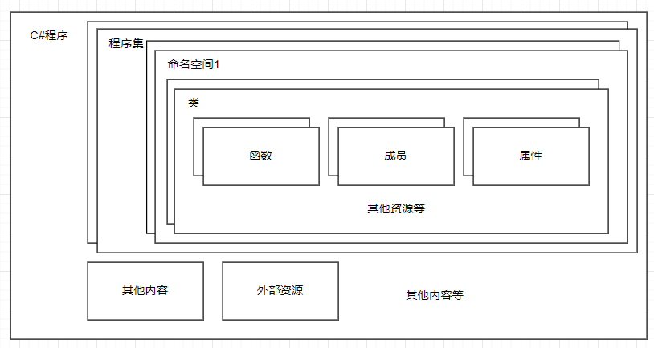

# 认识C#代码

一个C#程序通常是这样组成  
  

程序里面可以有多个`程序集(dll)`
一个程序集里面可以有多个`命名空间(namespace)`  
一个命名空间里面可以多个`类(class)`  
一个类里面可以有多个`函数(function)`，`成员变量(field)`，`属性(property)`，等其他内容  
函数里面就是实际代码了，就是你想让程序需要做些什么事情  

不同的命名空间里面可以有名字相同的类  
不同的类里面可以有名字相同的函数、变量、属性等  

观察生成的示例代码

```C#
namespace ConsoleApp1
{
    internal class Program
    {
        static void Main(string[] args)
        {
            Console.WriteLine("Hello, World!");
        }
    }
}
```

可以看到有：
- `namespace ConsoleApp1`表示里面是该命名空间的内容，`ConsoleApp1`是命名空间的名字  
- `internal class Program`表示里面是该类的内容，`internal`表示这个后面的东西是部分公开的，`Program`指的是类名  
- `static void Main(string[] args)`表示里面是函数名字为`Main`的`静态函数`，输入类型为string类型的字符串，无输出  
- `Console.WriteLine("Hello, World!");`，指的是调用类`Console`里面的静态函数`WriteLine`，目的是往控制台输出一个`Hello, World!`字符串  

在这个最简单的示例代码里面，就包含了C#中基础知识  
`命名空间(namespace)`这个与`C++`的命名空间是同一个概念，用于区分代码所在的区域，常见使用`{}`大括号把它包裹起来  
有时会简写成
```C#
namespace ConsoleApp1;

internal class Program
{
    static void Main(string[] args)
    {
        Console.WriteLine("Hello, World!");
    }
}
```
表示下面的内容都是属于`ConsoleApp1`这个命名空间里面  

`类(class)`这个与`C++`的类也是同一个概念，这是面向对象的最基本的内容  

这里`namespace`和`class`可以先理解为这是个盒子，里面可以装内容，和其他地方区分开来  

`函数(function)`就是对重复功能的包装，所有需要执行的代码都需要写在函数里面，程序要有函数才能执行操作，函数只能放在类里面，不能放在命名空间里面，及不能这样写  
```C#
namespace ConsoleApp1;

static void Main(string[] args)
{
    Console.WriteLine("Hello, World!");
}
```
**这样写是错误的，函数需要在类里面**  
函数里面就是程序的具体操作，例如里面可以有`赋值语句`，`函数调用`，`计算`等，**所有你想让程序执行的内容都需要写在函数里面**  

`internal`是一个`访问修饰符`，表示这个东西的能够访问的范围  
常用访问修饰符为：
- `public`表示任何地方都可以访问
- `internal`表示只能在当前程序集内访问
- `protected`表示只能类或派生自包含类访问
- `private`表示只有自己的类才能访问
还有一个不常用的：
- `file`表示仅在当前源文件中可以访问

`static`表示静态，

一个C#程序里面，至少要有一个名字为`Main`的静态函数，否则将无法编译


