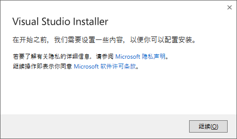
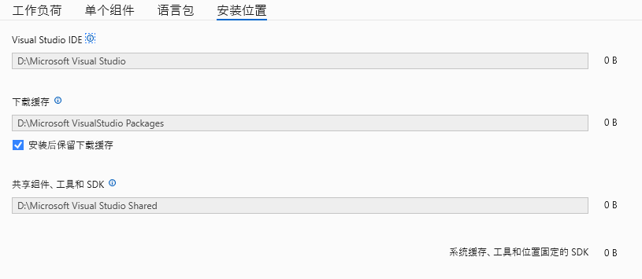

# C#介绍

`C#`是微软在`2000年6月发布`的一个使用`.NET框架`，继承了`C/C++`的强大，综合了`JAVA`的灵活性，同时是一门非常热门的编程语言  
`C#`可以用在桌面平台开发(WPF，Winform)，Web应用开发(Asp)，跨平台移动开发(Maui)，游戏开发(Unity)、IoT设备程序开发(某些柜台机会用)，人工智能等领域(AI)  

`C#`是一门编译型强类型语言，编译后生成中间二进制(IL)，需要在Dotnet虚拟机上运行，因此可以实现生成一次在各类操作系统上运行，其运行效率最大可达90%的`C/C++`，某些情况下可能会比`C/C++`还要快  
支持[Native AOT](https://learn.microsoft.com/zh-cn/dotnet/core/deploying/native-aot/)编译，可以生成本机二进制代码加速启动，减少第一次启动时间  

公共语言运行时[CLR](https://learn.microsoft.com/zh-cn/dotnet/standard/clr)是`.NET`提供了一个称为公共语言运行时的运行时环境，它运行代码并提供使开发过程更轻松的服务，C#编译后会生成CLR可以识别的二进制文件，同时C#也可以访问并调用CLR二进制里面的内容  

`.Net`有`.NET Core`与`.NET Framework`两种，目前常用的是`.NET Framework`，但是新软件开发都选择`.NET Core`，dotnet8指的就是`.NET Core 8`  
`.NET Framework`是windows自带的框架只能在windows上运行，而`.NET Core`可以在大部分主流操作系统上运行  
关于.Net的更多内容，可以在[微软文档](https://learn.microsoft.com/zh-cn/dotnet/core/introduction)里面查看，这里只关注C#  

到2025年，dotnet已经发展到了`dotnet10`，增加了许多特性，~~但dotnet9有一个[严重的bug](https://github.com/dotnet/runtime/issues/109812)等它修复并发布了再推荐使用~~  
由于dotnet9属于标准维护时长STS，dotnet10目前正在预览版中，本教程选择`dotnet8`为教程版本  
非特殊情况下dotnet的语言会向下兼容，所以你在dotnet8下编写的代码基本都能在更新的dotnet上运行，反之不行  
有些时候还会二进制兼容，也就是dotnet8下编译生成的文件可以继续在更高版本的dotnet下正常运行，因此不需要过于担心兼容性问题  

`C#`支持指针使用，开启不安全代码支持后，可以在C#里面使用指针，从而可以很方便的与`C/C++`库相互调用  
同时还带有很多语法糖，极大的简化了代码长度  
如果你学习过`C/C++`或者`Java`语言，则可以很快的上手  
自带独特的`Linq`，可以让你快速查找需要的数据  
以及多线程支持的`async`与`await`，可以让你方便的快速编写`异步多线程`代码

## 编程环境搭建

在Windows下，使用C#编程语言编写软件有很多种方法，你可以选择使用
- Visual Studio 2022
- VSCode + Dotnet SDK
- Rider + Dotnet SDK

要使用`Visual Studio 2022`，首先需要下载并安装`Visual Studio Install`  
打开这个[下载地址](https://visualstudio.microsoft.com/zh-hans/vs/community/)点击下载  
  
安装`Visual Studio Install`  
  

选中`Visual Studio Community 2022`
安装下面组件
- ASP.NET 和 Web开发
- .Net桌面开发
- Windows应用程序开发
- Visual Studio 扩展开发

然后在安装位置修改你需要的位置即可  
  

安装完成后启动即可完成搭建

如果要使用`VSCode + Dotnet`，首先需要下载并安装[VSCode](https://code.visualstudio.com/)与[Dotnet SDK](https://dotnet.microsoft.com/zh-cn/download)  
安装完成后，打开`VSCode`安装插件[C# Dev Kit](https://marketplace.visualstudio.com/items?itemName=ms-dotnettools.csdevkit)  
具体教程这里不提供，主要以VS为主  

如果你使用[Rider](https://www.jetbrains.com/zh-cn/rider/)作为开发IDE，这个也是下载并安装就可以了，但同时也需要安装[Dotnet SDK](https://dotnet.microsoft.com/zh-cn/download)  

[下一章](./page2.md)