[上一章](./page1.md)

# 认识开发工具VS2022

微软官方为开发者提供了一个C#的集成开发工具`Visual Studio 2022`，用户在`Windows`系统上，使用该`开发工具`即可完成C#相关的开发，包括桌面、服务器、游戏等相关开发，会使用这个工具即可减少很多开发相关的工作量  
`Visual Studio 2022`不止可以开发C#，还能开发C++，python等，只要在安装器里面安装了对应的开发环境，无需额外手动安装其他东西，即可开发对应的语言，如有需要可以自行进行研究  
在上一章已经说明了这个开发工具如何进行安装，本章节主要说明该工具如何使用  

## 创建工程

要使用`Visual Studio 2022`创建实例工程，打开`Visual Studio 2022`，点击右侧的`创建新项目`  
  
选择控制台应用  
  
选择一个位置
  
选择dotnet8
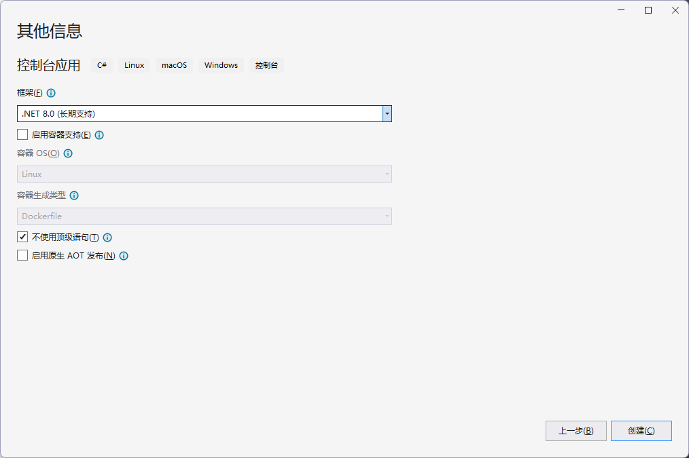  
这样就创建好了一个项目  
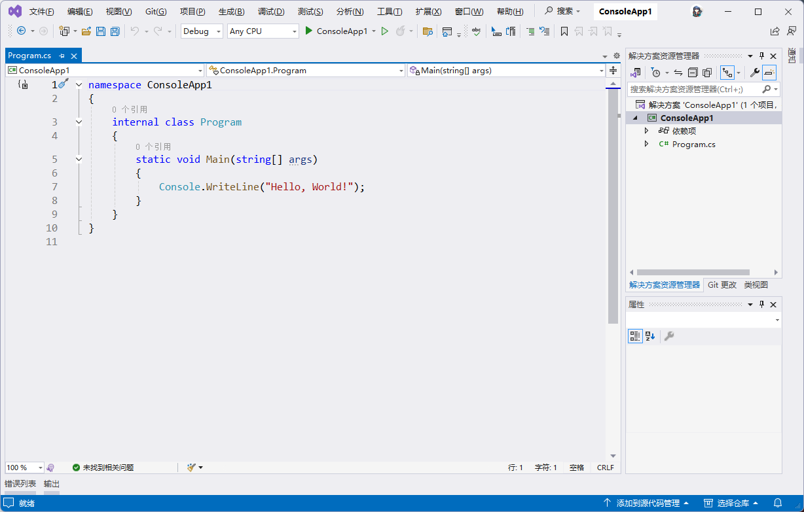  
点击上方绿色箭头的`ConsoleApp1`，就可以生成并启动  
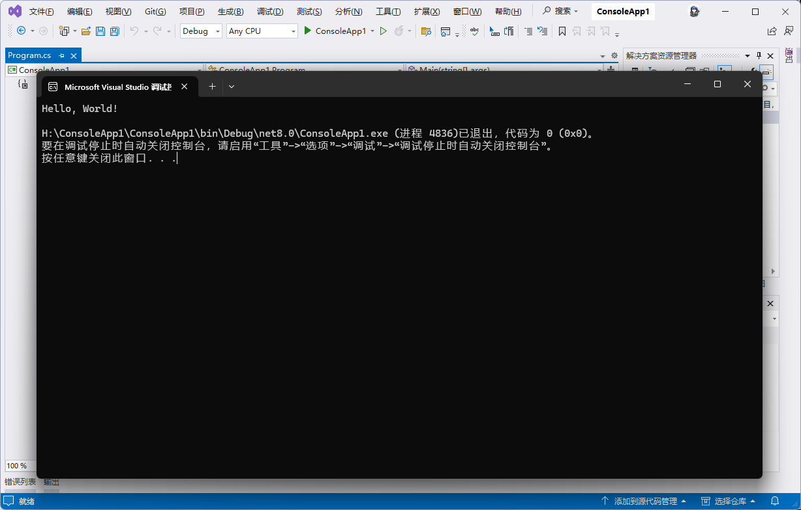  

## 解决方案与项目

VS2022创建工程会生成一个`解决方案`和一个`项目`

这个工程分为几层
```
- 解决方案(ConsoleApp1)
  - 项目(ConsoleApp1)
    - 源代码/源文件(Program.cs)
```
`解决方案`里面可以包含多个`项目`，`项目`里面可以包含多个`源代码/源文件`  
编译器生成是按照`项目`来的，一个项目会生成一个产物，指定生成解决方案会同时生成里面的项目  
`解决方案`里面的`项目`不一定是C#语言的项目，还可以是其他编程语言的项目，在某些混合语言编程时可以方便管理项目  
一般我们做软件，是以解决方案为单位去做，将模块拆分成一个个项目单独编写，然后使用依赖的方式让它们有机组合在一起，最后打包成一个`独立软件`  
例如我这个软件使用了某些算法和图形界面，会把算法相关代码整理成一个模块，然后放在一个项目，之后又把图形界面整合成另一个项目，最后再使用一个顶层项目，将这些项目依赖组合起来，最后生成打包放在一起  

在编写项目的时候，可能会想使用其他人的库，减轻软件开发的压力，此时只需要在项目里面添加引用其他人编写好的运行库，无论是C#还是C写的语言，只要是能加载进来就都可以使用  
dotnet里面提供了一个非常方便的包管理器，可以自动导入并使用别人打包好的运行库，你可以通过安装`nuget包`来实现  
nuget包的搜索与安装可以通过VS2022自带的包管理器来实现  
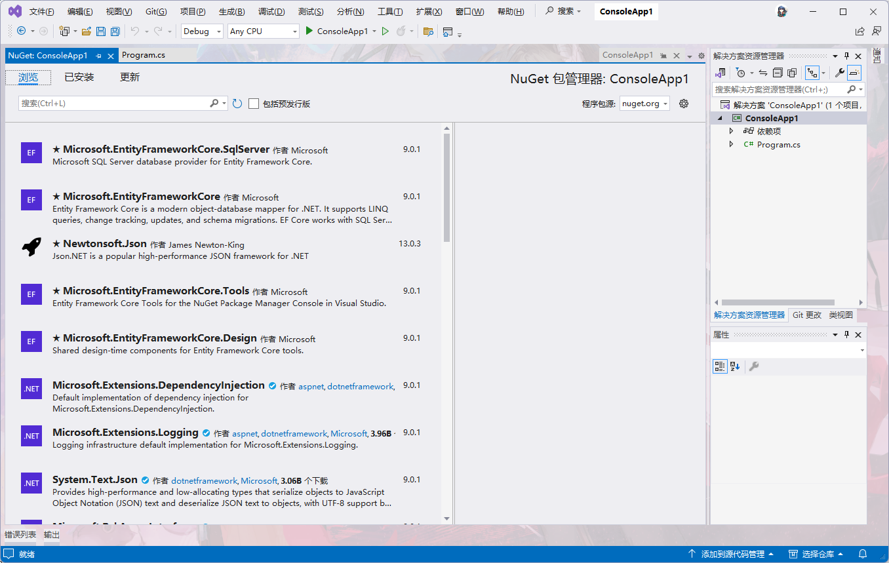  
nuget包里面有可能会带有本机二进制代码，就是使用非C#语言编写的库，在编译后会在生成目录下创建一个`runtime`文件夹，这里面会有各个平台的本机二进制  

项目之间可以引用，引用之后可以调用其他项目里面的东西，在编译时会把另一个项目同时编译，然后以类库的方式使用  
但是引用只能单向引用，禁止双向引用或者循环引用  
  
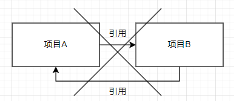  
  
如果项目B引用了项目C，项目A在引用项目B后，会隐形的引用项目C  
nuget包也同理  
项目A安装了nuget包A，项目B安装了nuget包B  
若项目A引用了项目B，则相当于安装了nuget包B  
若项目A和项目B同时安装了nuget包A，且版本不一样，可能会导致包版本冲突，需要手动选择较高版本的安装  

## 项目编译

`C#`为`编译型语言`，运行前需要进行`编译`  
在VS中，点击上方的`生成`，选中`生成解决方案`即可开始编译代码  
  
由于解决方案里面是多项目，你也可以选中其中项目进行编译  
在右侧的解决方案列表中，选中项目右键，点击`生成`即可生成该项目  
  
在生成时，会同时生成依赖的项目，例如`项目A`依赖了`项目B`，在编译`项目A`时会同时生成`项目B`  
若代码出现错误，或者编译出现异常，则会导致编译失败，此时下方会提示编译失败的问题，双击即可转到对应的行  
  
如果你不解决这些问题，该项目与依赖的项目都无法正常编译  

## 打包与发布

当你编写好你的程序后，进行打包并发布时，需要注意，若是从生成文件夹里面获取的，则不会包含程序运行所需要的运行环境，其他用户在使用你的程序时，需要安装dotnet才能正常使用  
这是，你就需要通过发布器来对你的程序进行打包  
首先在VS中右键需要发布的项目，选择`发布`  
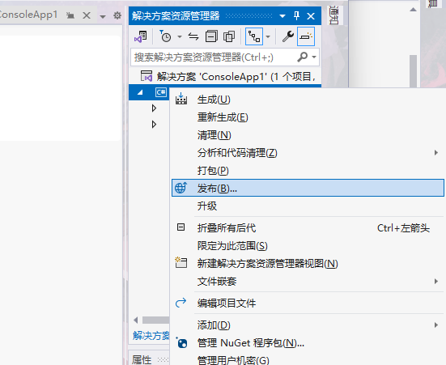  
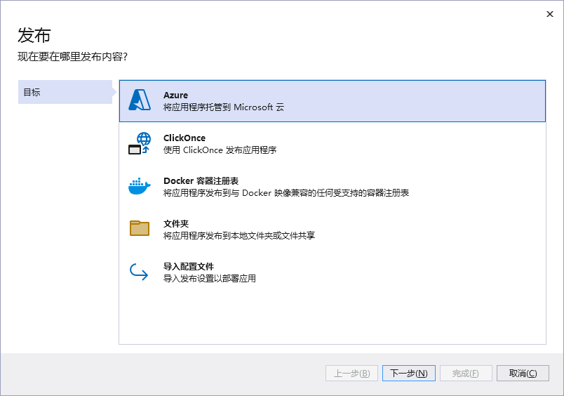  
发布的方式有很多种，这里选择`文件夹`，就是把生成的文件保存到本地  
  
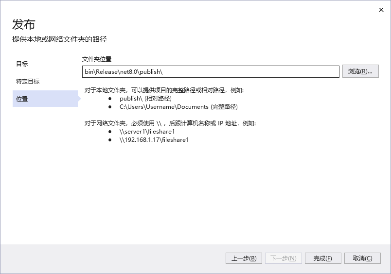  
设置好路径后点击`完成`  
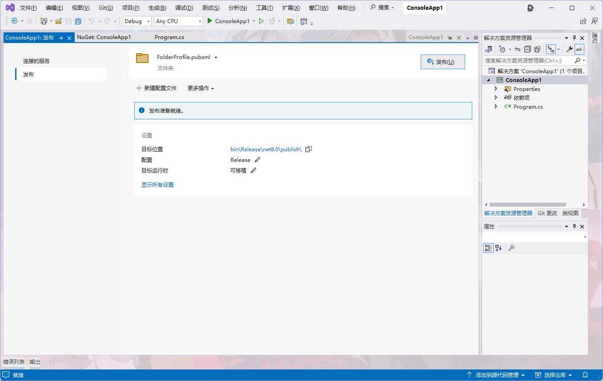  
此时就发布前的操作  

如果你不想让你的用户运行的时候也去安装个dotnet，则需要修改发布选项，点击`显示所有设置`  
然后可以根据我这个选项来设置  
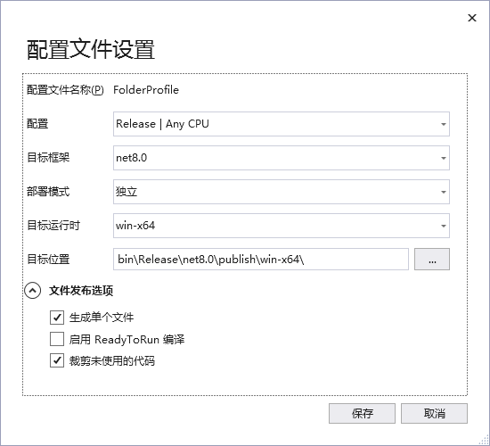  
`保存`后点击右上角的`发布`  
这样就开始编译并一起打包dotnet框架了  
打包好之后只有2个文件，但如果你使用了其他库会有多个文件，你只需要把这个文件夹压缩之后发布，就可以让其他人直接运行了  
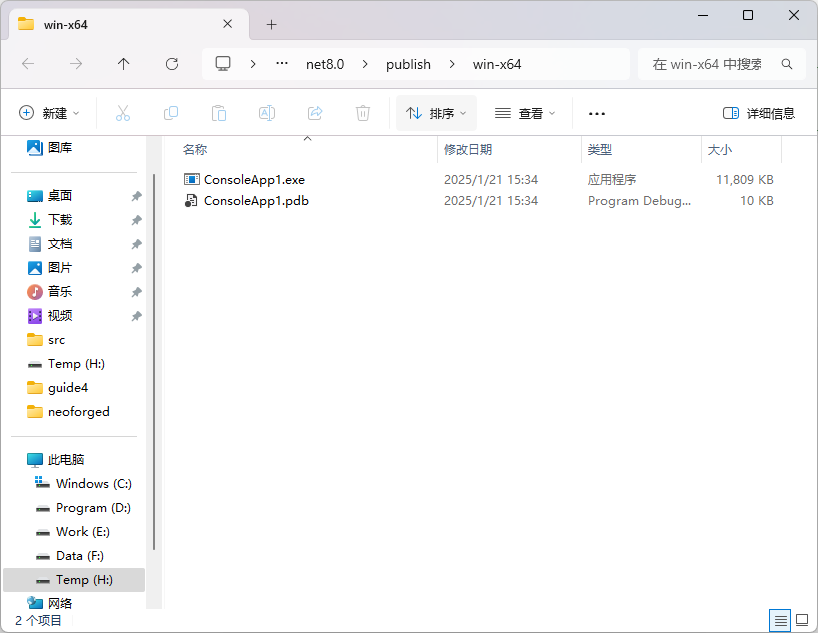  

## 开发工具扩展

VS2022支持安装一些开发用的扩展  
点击上方的`扩展`，选择`管理扩展`即可转到`扩展管理器`
  
  
在扩展管理器，你可以下载并安装想要的扩展，例如我的VS2022安装了美化扩展，就可以在主界面设置一个背景图  
  
又或者我在编写界面时，需要自动帮我格式化xaml文件，也可以安装一个XAML格式化扩展实现  
  
你可以根据需要安装想要的扩展  

## 开发工具设置

为了能够高效的开发C#软件，可以对开发工具进行一些设置，这是我使用的设置  
选择上方的`工具`然后点击`选项`，打开开发工具设置  
  
  
在左侧的搜索栏，输入`字体`，然后点击设置项，可以设置编辑器里面的所有字体  
  
然后搜索`换行`，选择`所有语言`，勾选自动换行后，在编辑器里面的代码过长就会自动换行显示了  
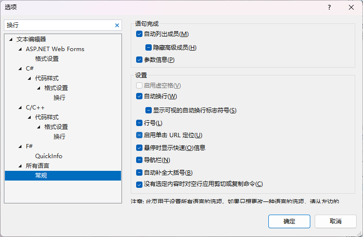  
最后搜索`我的代码`，点击调试选项，取消勾选仅我的代码，这个在后面做调试的时候有帮助  
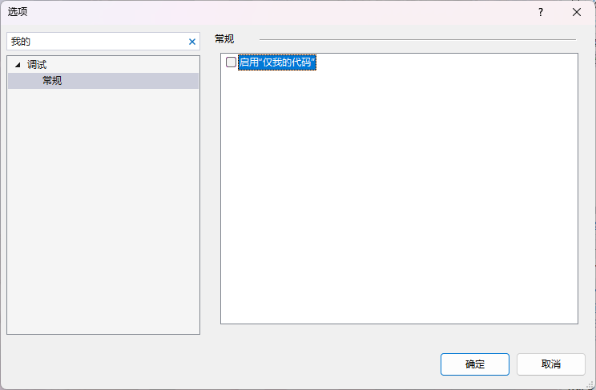  

这就是我的目前在使用的设置，你也可以根据自己的需要进行调整  

[下一章](./page3.md)