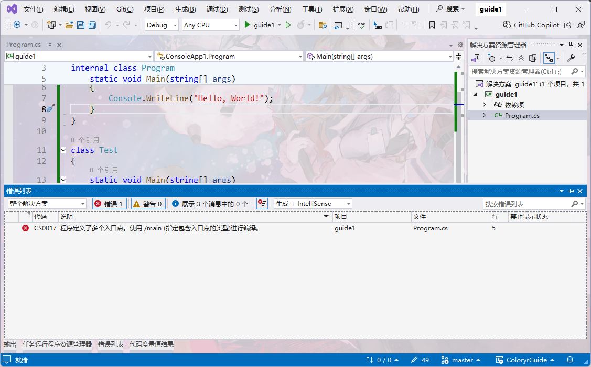

[上一章](./page2.md)

# 认识C#代码

一个C#程序通常是这样组成  
  

程序里面可以有多个`程序集(dll)`
一个程序集里面可以有多个`命名空间(namespace)`  
一个命名空间里面可以多个`类(class)`  
一个类里面可以有多个`函数(function)`，`成员变量(field)`，`属性(property)`，等其他内容  
函数里面就是实际代码了，就是你想让程序需要做些什么事情  

不同的命名空间里面可以有名字相同的类  
不同的类里面可以有名字相同的函数、变量、属性等  

观察生成的示例代码

```C#
namespace ConsoleApp1
{
    internal class Program
    {
        static void Main(string[] args)
        {
            Console.WriteLine("Hello, World!");
        }
    }
}
```

可以看到有：
- `namespace ConsoleApp1`表示里面是该`命名空间`的内容，`ConsoleApp1`是命名空间的名字  
- `internal class Program`表示里面是该`类`的内容，`internal`表示这个后面的东西是部分公开的，`Program`指的是类名  
- `static void Main(string[] args)`表示里面是`函数`名字为`Main`的`静态函数`，输入类型为string类型的字符串，无输出，而`Main`函数我们一般称之为`主函数`，也就是程序执行的入口  
- `Console.WriteLine("Hello, World!");`，指的是调用类`Console`里面的静态函数`WriteLine`，目的是往控制台输出一个`Hello, World!`字符串  
- 内容都是使用`{}`进行包裹起来，这是非常重要的，在大部分时候，你的代码都需要使用`{}`来表示范围，但在一些地方，为了方便节省空间，大括号可以省略不写  

## 命名空间、类、函数

在这个最简单的示例代码里面，就包含了C#中基础知识  
`命名空间(namespace)`这个与`C++`的命名空间是同一个概念，用于区分代码所在的区域，常见使用`{}`大括号把它包裹起来  
有时会简写成
```C#
namespace ConsoleApp1;

internal class Program
{
    static void Main(string[] args)
    {
        Console.WriteLine("Hello, World!");
    }
}
```
表示下面的内容都是属于`ConsoleApp1`这个命名空间里面，这是对`namespace`的一种简化写法，减少大括号因格式化引起的前面代码空格过多问题，这样写可以更方便阅读，同时可以减少源代码体积  

`类(class)`这个与`C++`的类也是同一个概念，这是面向对象的最基本的内容，其里面的内容也是使用`{}`包裹起来  

这里`namespace`和`class`可以先理解为这是个盒子，里面可以装内容，和其他地方区分开来  

`函数(function)`就是对重复功能的包装，所有需要执行的代码都需要写在函数里面，程序要有函数才能执行操作  
函数只能放在类里面，不能放在命名空间里面，例如不能这样写  
```C#
namespace ConsoleApp1;

static void Main(string[] args)
{
    Console.WriteLine("Hello, World!");
}
```
**这样写是错误的，函数需要在类里面**  

函数可以放在函数里面，例如  
```C#
namespace ConsoleApp1;

internal class Program
{
    static void Main(string[] args)
    {
        void Test()
        {

        }

        Console.WriteLine("Hello, World!");
    }
}
```
这样写是允许的，`Test`函数也叫做`本地函数`  
函数里面就是程序的具体操作，例如里面可以有`赋值语句`，`函数调用`，`计算`等，**所有你想让程序执行的内容都需要写在函数里面**  

**具体操作语句需要放在函数里面，不能单独放在命名空间或者类里面**  
例如
```C#
namespace ConsoleApp1;

internal class Program
{
    Console.WriteLine("Hello, World!");
}
```
或者
```C#
namespace ConsoleApp1;

Console.WriteLine("Hello, World!");
```
都是不正确的

但有些时候，你会看到另一种奇怪的写法，这中写法是对的
```C#
Console.WriteLine("Hello, World!");
```
是的没错，整个源代码文件里面只有这一行代码，这是dotnet的`顶级代码`特性  
表示这整个源文件里面的代码都会放在`Main函数`里面，此时命名空间和类名都由编译器帮你填写  
这个写法可以用作C#软件的快速开发，省去写命名空间与类的麻烦  

## 修饰符

在下面这还代码中
```C#
internal class Program
```
`internal`是一个`访问修饰符`，表示这个东西的能够访问的范围  
常用访问修饰符为：
- `public`表示任何地方都可以访问
- `internal`表示只能在当前程序集内访问
- `protected`表示只能类或派生自包含类访问
- `private`表示只有自己的类才能访问
还有一个不常用的：
- `file`表示仅在当前源文件中可以访问
默认情况下，没有声明`访问修饰符`默认是`private`，也就是私有的，只能自己访问  

然后下面这行函数的代码
```C#
static void Main(string[] args)
```
`static`可以也是一个修饰符，表示里面的内容为静态  
静态的东西可以直接调用，而没有静态的东西需要`实例化`之后才能调用，这里可以先不用理解在后面的章节再理解  

`internal`和`static`可以给`class`或者函数，但不能给命名空间  

## 主函数

在一个C#可运行的程序里面，至少要有一个名字为`Main`的静态函数，否则将无法编译  
也就是这个项目如果编译成一个可执行的软件，需要一个主函数，也就是程序入口  
如果这个项目编译成一个类库，则可以不需要有这个函数  
同时，你也可以添加多个`Main`静态函数在不同的类里面，但是在编译的时候需要添加一个编译设置，表示那个才是真正的入口函数  
  

## 注释

在代码中，可以添加注释来给写的代码添加说明，**这些注释不会参与代码编译**，因此可以用来记录一些信息，方便阅读代码时理解  
一般注释以`//`开头或者`/*`开头`*/`结尾  
```C#
namespace ConsoleApp1;

internal class Program    //这是一个类
{
    static void Main(string[] args)  //这是主函数
    {
        /*
        往控制台输入内容
        */
        Console.WriteLine("Hello, World!"); //输出Hello world
    }
}
```
然后还有一种特殊的说明注释，是下面这种形式  
```C#
internal class Program
{
    /// <summary>
    /// 主函数
    /// </summary>
    /// <param name="args">程序输入内容</param>
    static void Main(string[] args)
    {
        Console.WriteLine("Hello, World!");
    }
}
```
这个一般用于给函数，类等内容添加文档说明，也就是在其他地方也能看到这个注释  
因此叫做`XML 文档注释`，用于生成代码的 API 文档

本章完整代码参考[src/guide1](./src/guide1/Program.cs)

[上一章](./page4.md)
